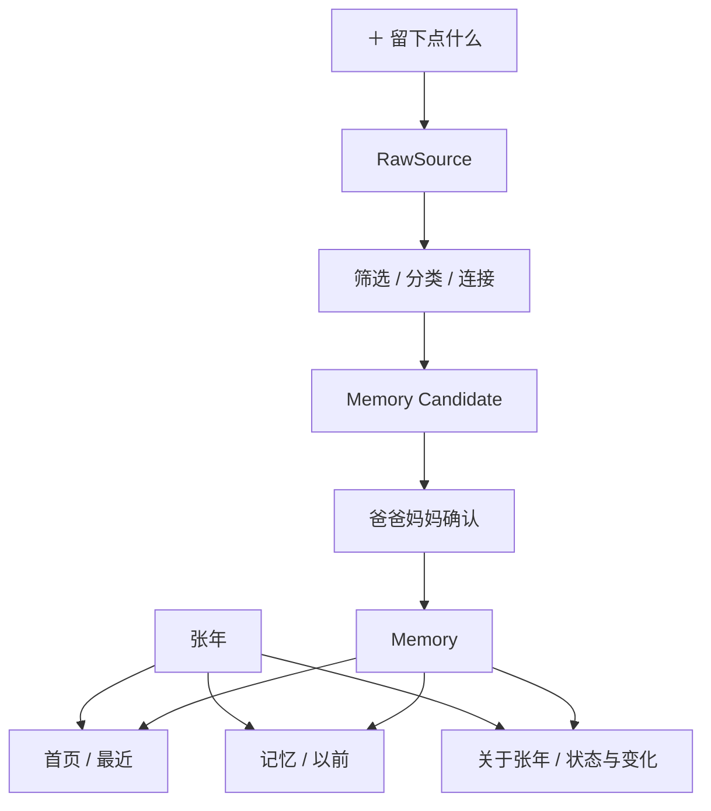

# Nian Life V2 产品结构定版

## 问题与目标

现有 Home、Timeline、Archive、Growth 与 Inbox 在一级导航中语义重叠，也容易让产品滑向 Dashboard、CMS 或文件整理器。本轮把它们收敛为一个长期家庭人生档案：生活发生后留下真实痕迹，经筛选与家庭确认成为记忆，并在更久以后重新遇见。

## 选定方向

视觉选择 **Editorial Luxury**：米白纸张、暖黑、暖砖红、中文 serif、非对称编辑布局、真实摄影优先。图片型页面使用更宽画布，阅读型页面保持较窄行宽；组件依靠排版、间距和分隔线建立层级，不依靠统一圆角卡片。

产品结构：

## 关键设计

- Home 只展示最近，以 Recent Memory Canvas 播放已确认的最近 LifeEvent。
- Timeline 与 Archive 合并为“记忆”，Event / Day、Month、Year 是三种阅读尺度。
- `trace / memory / highlight / chapter` 是内部记忆重量，用户只看到自然的“留在年鉴”。
- Memory 允许只有一句话、照片、视频或原话，不由完整 CMS schema 反向强迫生活。
- LifeEvent 详情坚持可修改 Story 与不可覆盖 Evidence 双层结构。
- RawSource 的 `sourceType`、`contentTypes` 与 `contributorId` 互相独立。
- “关于张年”从成长、睡眠与照护角度重新阅读同一段历史，不建立平行内容库。
- 医疗资料进入受控提取与确认流程；AI 不诊断、不改写医疗事实。

## 被拒绝的方向

- 继续保留 Growth / Archive / Inbox 一级入口：语义碎裂，长期会形成多个平行产品。
- 把首页改成普通图片轮播：只播放媒体，不能表达最近的人生变化。
- 把 About 做成六张指标卡：会退化为儿童 Dashboard。
- 用完整表单强制每条 Memory 都有标题、故事、地点、人物、标签和图库：会制造记录负担。
- AI 为每天生成完整故事：造成内容膨胀，并稀释真实原话。

## 约束与假设

- 本轮只使用合成 / 既有 Mock 数据；不建立数据库、认证、真实上传或 AI 服务。
- V1 文件与媒体保持可运行，V2 不继承其 DOM / CSS 结构。
- 健康与儿童媒体默认敏感；真实发布前必须有服务端授权与家庭成员确认。
- 当前日期与年龄均以 2026 年 8 月产品场景为准，历史测量不覆盖。

## 验证策略

- TypeScript、ESLint 与生产构建。
- Desktop / Mobile 的导航、Home、Memory、Month / Year、About、Capture、Candidate、Story / Evidence。
- 中文大标题断行、图片比例、alt、touch target、focus-visible、reduced motion 与 console。
- 用 `web-design-guidelines` 做交付前 UI 与可访问性复核。

## 未解决事项

- 当前运行环境无可用浏览器实例，仍需在 Preview 对真实渲染进行人工截图检查。
- 真实认证、授权、媒体上传、历史修订和 AI / 医疗流程均留待后续阶段；本轮完成后停止。
