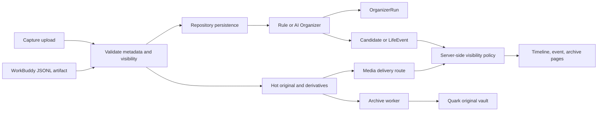

# Nian Life V2 Claude Code Handoff

> **2026-08-31 后续更新**：Quark artifact P0 安全修复（`.gitignore` 覆盖 WorkBuddy 运行时目录 + Windows reparse-point 防护）已完成，对应提交 `b161338`。Gemini Organizer V2 provider 已审计、整理并验证，对应提交 `5a444a2`。文档主体仍是审计时点的快照，最新事实以 Git 历史和 [`CLAUDE.md`](../CLAUDE.md) 为准。
>
> 这是一份基于代码、测试输出和 Git 快照的仓库交接文档。它不把设计意图、类型声明或页面存在误写成生产能力。

## 1. 文档目的与结论口径

本文件回答三个问题：当前仓库实际能做什么、哪些地方有可验证的风险、Claude Code 下一次应该先完成什么。

状态标签约定如下：

- **已验证**：有源码路径、测试或本地命令输出支持。
- **潜在风险**：由源码路径直接推导出的缺口或设计风险，但没有在生产环境证明已发生。
- **创新建议**：尚未实现的产品或工程方向，不应当被当作当前能力。
- **无法确认**：仓库中没有足够证据，不能推断部署、数据规模、真实账号状态或线上行为。

所有业务结论均附仓库相对路径证据；架构文档只代表目标或约束，不替代运行时代码证据。

## 2. 审计快照

**已验证**：本次审计快照为 2026-08-30，当前分支是 `feat/ai-organizer-v1`，HEAD 是 `a8d07d9b4ca2818693b21da871a44b0e81a9d756`，并显示与 `origin/feat/ai-organizer-v1` 同步。工作区在审计开始时有 7 个已修改文件和 7 个未跟踪文件；没有执行 commit、push、发布或回滚。

证据：`git status --short --branch`、`git rev-parse HEAD`、`git log --oneline --decorate -n 12`；相关历史包括 [`v2/lib/organizer`](../v2/lib/organizer)、[`v2/tools/quark-connector`](../v2/tools/quark-connector) 和 [`v2/app/actions.ts`](../v2/app/actions.ts)。

当前工作区差异主题：

- 已修改：[`v2/.env.example`](../v2/.env.example)、[`v2/lib/organizer/ai.ts`](../v2/lib/organizer/ai.ts)、[`v2/lib/organizer/evaluation.ts`](../v2/lib/organizer/evaluation.ts)、[`v2/lib/organizer/media-input.ts`](../v2/lib/organizer/media-input.ts)、[`v2/lib/organizer/provider.ts`](../v2/lib/organizer/provider.ts)、[`v2/lib/organizer/types.ts`](../v2/lib/organizer/types.ts)、[`v2/package.json`](../v2/package.json)。
- 未跟踪：[`v2/lib/organizer/gemini-schema.ts`](../v2/lib/organizer/gemini-schema.ts)、[`v2/lib/organizer/prompts/v2.ts`](../v2/lib/organizer/prompts/v2.ts)、[`v2/lib/organizer/schema-v2.ts`](../v2/lib/organizer/schema-v2.ts)、[`v2/scripts/compare-organizer-gemini.mjs`](../v2/scripts/compare-organizer-gemini.mjs)、[`v2/scripts/evaluate-organizer-gemini.mjs`](../v2/scripts/evaluate-organizer-gemini.mjs)、[`v2/scripts/smoke-organizer-gemini.mjs`](../v2/scripts/smoke-organizer-gemini.mjs)、[`v2/test/gemini-provider.test.mjs`](../v2/test/gemini-provider.test.mjs)。
- `git diff --stat` 对已跟踪差异报告 179 insertions、18 deletions；未跟踪文件不计入该统计。以上工作区变化不是本次交接文档创建造成的，后续不要未经审阅就混入其他提交。

## 3. 审计范围与排除项

**已验证**：已沿着 V1/V2 边界、Next App Router 入口、Server Action、Repository、领域类型、媒体/存储、Organizer、Quark 工具、迁移、脚本、测试、架构文档和 agent 规则进行逐文件或结构审计。

证据范围：[`index.html`](../index.html)、[`v2/app`](../v2/app)、[`v2/components`](../v2/components)、[`v2/lib`](../v2/lib)、[`v2/scripts`](../v2/scripts)、[`v2/tools`](../v2/tools)、[`v2/test`](../v2/test)、[`v2/drizzle`](../v2/drizzle)、[`docs`](.)、[`ai-artifacts/plans`](../ai-artifacts/plans)。

以下内容没有被读取或执行，因此不能据此作线上结论：

- [`v2/.env.local`](../v2/.env.local) 的值、任何密码、Token、Cookie、API key。
- 真实 PostgreSQL、R2、Quark 账号、Gemini/OpenAI API 和部署环境。
- 真实 Quark CLI 登录、下载、全盘扫描和任何带副作用的 migration。
- 二进制媒体的逐个内容审查；媒体处理只通过源码和已有测试确认行为。
- 浏览器端 E2E、并发压力、灾备恢复、线上日志和线上权限配置。

## 4. 仓库规则与不可破坏边界

**已验证**：V1 是历史参考与可运行静态页面，V2 必须在 `v2/` 作为新的 Next.js App Router 应用维护，不能把 V1 DOM/CSS 直接重构成 React。儿童照片、视频、健康记录和家庭信息默认按敏感数据处理，媒体要有授权、来源、可见性、alt 文本和保留策略；发布前需要 Preview 验证。

证据：[`AGENTS.md`](../AGENTS.md)、[`.github/copilot-instructions.md`](../.github/copilot-instructions.md)、[`index.html`](../index.html)、[`docs/v2-architecture.md`](v2-architecture.md)、[`docs/hybrid-media-architecture.md`](hybrid-media-architecture.md)。

本次交接文档遵守的工作区约束：除本文件外不修改业务代码、配置、数据库、依赖、部署文件或 Git 历史。

## 5. V1 与 V2 所有权边界

| 边界 | 当前事实 | 证据 |
| --- | --- | --- |
| V1 | 根目录 `index.html` 是独立静态页面和历史视觉参考；本次没有修改它 | [`index.html`](../index.html)、[`AGENTS.md`](../AGENTS.md) |
| V2 | 新应用位于 `v2/`，通过 `basePath: "/v2"` 服务 | [`v2/next.config.ts`](../v2/next.config.ts)、[`v2/app/layout.tsx`](../v2/app/layout.tsx) |
| 资产 | 根目录 `assets/` 与 V2 的 `public/` 都存在；页面使用 V2 路径，Organizer smoke script 还读取根目录测试图片 | [`assets`](../assets)、[`v2/public`](../v2/public)、[`v2/scripts/smoke-organizer-gemini.mjs`](../v2/scripts/smoke-organizer-gemini.mjs) |
| 数据 | V2 当前 JSON Store 使用 mock-data 初始化；PostgreSQL/Drizzle 是目标边界，不是已证明的页面运行时 | [`v2/lib/db/repository.ts`](../v2/lib/db/repository.ts)、[`v2/lib/mock-data.ts`](../v2/lib/mock-data.ts)、[`v2/lib/db/schema.ts`](../v2/lib/db/schema.ts) |

## 6. 技术栈与目录结构

**已验证**：V2 是一个独立的 Next.js 项目，不是多包 monorepo。声明的主要技术是 Next.js 15.5.24、React 19.1.0、TypeScript、Tailwind CSS 4/PostCSS、Drizzle ORM、PostgreSQL driver、Sharp 和 AWS S3 SDK。

证据：[`v2/package.json`](../v2/package.json)、[`v2/package-lock.json`](../v2/package-lock.json)、[`v2/postcss.config.mjs`](../v2/postcss.config.mjs)、[`v2/drizzle.config.ts`](../v2/drizzle.config.ts)。

关键层次：

- `v2/app`：页面、布局、Route Handler、Server Action。
- `v2/components`：客户端交互和展示组件。
- `v2/lib/types.ts`：页面和 Repository 使用的领域类型。
- `v2/lib/db`：JSON Repository、接口、Drizzle schema 和媒体辅助查询。
- `v2/lib/organizer`：规则 Organizer、AI provider、schema、policy、evaluation。
- `v2/lib/media` 与 `v2/lib/storage`：媒体派生、URL、Hot/R2 存储。
- `v2/lib/ingest`、`v2/lib/archive`、`v2/tools/quark-connector`：Quark 输入、存档和 WorkBuddy artifact 边界。
- `v2/drizzle`：4 个 SQL migration 和 Drizzle journal。

## 7. 运行时入口与部署证据

**已验证**：本地入口是 `v2/package.json` 中的 `dev`、`build`、`start`、`lint`、`typecheck`、`test`、Organizer 和 Quark scripts；Next 配置设置了 `/v2` base path，并允许通过 `NEXT_DIST_DIR` 改变构建目录。

证据：[`v2/package.json`](../v2/package.json)、[`v2/next.config.ts`](../v2/next.config.ts)、[`v2/tsconfig.json`](../v2/tsconfig.json)。本次命令验证：`typecheck` 通过、`lint` 通过、`build` 通过、42 个测试通过、默认 Organizer 评估 8/8 通过。

**无法确认**：没有足够的仓库证据确认线上平台、域名、Preview 项目、数据库实例、R2 bucket、CI workflow、回滚策略或生产环境变量。Next.js 和近期 Git 历史可以支持“可能使用 Vercel”的推测，但不能把它写成已部署事实。

证据：[`v2/next.config.ts`](../v2/next.config.ts)、[`v2/package.json`](../v2/package.json)、`git log --oneline --all`；未找到足以确认线上部署的正式配置。

## 8. App Router、API 与组件入口

**已验证**：V2 有首页、关于、归档、捕获、收件箱、时间线、事件详情、年度/月度 memory 页面，以及媒体、内部 ingest、Quark status Route Handler。页面可以构建，但“构建成功”不代表数据真实、权限完整或已部署。

入口证据：[`v2/app/page.tsx`](../v2/app/page.tsx)、[`v2/app/about/page.tsx`](../v2/app/about/page.tsx)、[`v2/app/archive/page.tsx`](../v2/app/archive/page.tsx)、[`v2/app/capture/page.tsx`](../v2/app/capture/page.tsx)、[`v2/app/inbox/page.tsx`](../v2/app/inbox/page.tsx)、[`v2/app/timeline/page.tsx`](../v2/app/timeline/page.tsx)、[`v2/app/events/[id]/page.tsx`](../v2/app/events/%5Bid%5D/page.tsx)、[`v2/app/memory/2026/page.tsx`](../v2/app/memory/2026/page.tsx)、[`v2/app/memory/2026/08/page.tsx`](../v2/app/memory/2026/08/page.tsx)、[`v2/app/api`](../v2/app/api)。

组件证据：[`v2/components/site-header.tsx`](../v2/components/site-header.tsx)、[`v2/components/memory-inbox.tsx`](../v2/components/memory-inbox.tsx)、[`v2/components/timeline.tsx`](../v2/components/timeline.tsx)、[`v2/components/media-grid.tsx`](../v2/components/media-grid.tsx)、[`v2/components/life-event-card.tsx`](../v2/components/life-event-card.tsx)、[`v2/components/evidence-list.tsx`](../v2/components/evidence-list.tsx)、[`v2/components/growth-chart.tsx`](../v2/components/growth-chart.tsx)、[`v2/components/sleep-journey-trend.tsx`](../v2/components/sleep-journey-trend.tsx)。

Server Action 证据：[`v2/app/actions.ts`](../v2/app/actions.ts)。它是捕获写入的主要应用入口，不是认证层。

## 9. 领域数据与来源链

**已验证**：类型层表达了 Profile、Contributor、RawSource、MediaAsset、MediaLocation、Media、LifeEvent、DailyTrace、CandidateMemory、GrowthRecord、CareRecord、CareEpisode、MonthlySnapshot、MonthArchive、YearArchive、OrganizerRun 和 ConnectorState 等概念。

证据：[`v2/lib/types.ts`](../v2/lib/types.ts)、[`v2/lib/organizer/types.ts`](../v2/lib/organizer/types.ts)。

当前 JSON demo 数据同时包含公开感知和敏感健康 mock 数据：profile、家庭媒体、睡眠阶段、医疗观察、医疗文档、候选记忆和月度归档均在同一个 mock-data 模块中。它适合展示页面形状，不足以证明真实数据已迁移或权限已实现。

证据：[`v2/lib/mock-data.ts`](../v2/lib/mock-data.ts)。

**潜在风险**：类型所表达的领域集合大于当前 PostgreSQL schema/migration 所表达的集合；例如 CandidateMemory、CareRecord、GrowthRecord、DailyTrace、月度/年度 archive 等没有在 0000-0003 SQL 中形成完整的对应运行时读写闭环。

证据：[`v2/lib/types.ts`](../v2/lib/types.ts)、[`v2/lib/db/schema.ts`](../v2/lib/db/schema.ts)、[`v2/drizzle/0000_real_data_foundation.sql`](../v2/drizzle/0000_real_data_foundation.sql)、[`v2/drizzle/0002_ai_organizer.sql`](../v2/drizzle/0002_ai_organizer.sql)。

## 10. 持久化与 Repository

**已验证**：页面和 Organizer 当前通过 [`v2/lib/db/repository.ts`](../v2/lib/db/repository.ts) 读写 `.data/nian-life.json`；Repository 初始化依赖 [`v2/lib/mock-data.ts`](../v2/lib/mock-data.ts)。`repository-interface.ts` 只有抽象契约，没有在审计路径中发现 PostgreSQL 实现或注入切换点。

证据：[`v2/lib/db/repository.ts`](../v2/lib/db/repository.ts)、[`v2/lib/db/repository-interface.ts`](../v2/lib/db/repository-interface.ts)、[`v2/lib/db/schema.ts`](../v2/lib/db/schema.ts)。

**潜在风险**：Repository 多处采用 read/modify/write；源码中没有数据库事务、文件锁、版本检查或并发冲突解决。单进程测试可以通过，但不能证明多请求或 serverless 实例下的历史记录不会互相覆盖。

证据：[`v2/lib/db/repository.ts`](../v2/lib/db/repository.ts)、[`v2/test/ai-organizer.test.mjs`](../v2/test/ai-organizer.test.mjs)；测试是串行运行的。

**潜在风险**：`tsconfig.json` 将 `lib/db/schema.ts` 排除在 TypeScript 检查之外，schema 与 migration 的字段漂移可能不会被 `npm run typecheck` 捕获。

证据：[`v2/tsconfig.json`](../v2/tsconfig.json)、[`v2/lib/db/schema.ts`](../v2/lib/db/schema.ts)、[`v2/drizzle/0003_quark_artifact_ingestion.sql`](../v2/drizzle/0003_quark_artifact_ingestion.sql)。

## 11. Capture 写入链

**已验证**：`captureSources()` 是上传主入口。它负责写入 Hot original、创建图片派生、组装 RawSource/MediaAsset/MediaLocation，并调用 Organizer；`memory-inbox.tsx` 负责从 Capture UI 调用这个 Server Action。

证据：[`v2/app/actions.ts`](../v2/app/actions.ts)、[`v2/components/memory-inbox.tsx`](../v2/components/memory-inbox.tsx)、[`v2/lib/media/processing.ts`](../v2/lib/media/processing.ts)。

**潜在风险**：Capture 的 profile/contributor 有硬编码默认值，visibility 主要是类型断言；没有在该入口看到用户身份、profile membership 或服务端授权决策。多步写入也没有事务或完整补偿流程，原始媒体、派生、元数据和 Organizer 可能出现部分成功。

证据：[`v2/app/actions.ts`](../v2/app/actions.ts)、[`v2/lib/db/repository.ts`](../v2/lib/db/repository.ts)、[`v2/lib/types.ts`](../v2/lib/types.ts)。

当前业务链路的边界可概括为：



图中 `artifact -> validate -> repo` 是当前已实现的 metadata 路径；artifact ingestion 尚未自动接到 RawSource、Media 和 Organizer。图中的统一 visibility policy、页面授权和 archive worker 调度仍是 P0/P1 工作项，不应因图中存在就视为已完成。

**无法确认**：没有生产存储、真实用户和断电/进程中止测试，不能断言线上一定发生了部分成功；这里只记录代码路径提供的风险。

## 12. Organizer 决策链

**已验证**：Organizer 工厂默认使用 RuleBased；`MEMORY_ORGANIZER=ai` 且没有被 `AI_ORGANIZER_ENABLED` 关闭时才选择 AI provider。预分组按日期、时间邻近和来源族整理 source batch。

证据：[`v2/lib/organizer/index.ts`](../v2/lib/organizer/index.ts)、[`v2/lib/organizer/pre-group.ts`](../v2/lib/organizer/pre-group.ts)、[`v2/lib/organizer/rule-based.ts`](../v2/lib/organizer/rule-based.ts)。

规则路径覆盖 medical、existing event、milestone、daily trace 和 store only；AI 路径是 Context -> provider -> schema validator -> policy -> persistence，并会记录 OrganizerRun。

证据：[`v2/lib/organizer/rule-based.ts`](../v2/lib/organizer/rule-based.ts)、[`v2/lib/organizer/context.ts`](../v2/lib/organizer/context.ts)、[`v2/lib/organizer/ai.ts`](../v2/lib/organizer/ai.ts)、[`v2/lib/organizer/policy.ts`](../v2/lib/organizer/policy.ts)、[`v2/drizzle/0002_ai_organizer.sql`](../v2/drizzle/0002_ai_organizer.sql)。

**已验证**：AI provider、schema 或 policy 失败时会 fallback 到规则 Organizer；fallback reason 会被记录，但调用方的最终结果仍可能表现为一次成功的规则组织。

证据：[`v2/lib/organizer/ai.ts`](../v2/lib/organizer/ai.ts)、[`v2/test/ai-organizer.test.mjs`](../v2/test/ai-organizer.test.mjs)。

**潜在风险**：如果产品需要让家庭知道“AI 未运行、AI 输出被策略拒绝或已改用规则”，当前返回/展示边界没有形成显式用户确认状态；这不是安全绕过的证明，而是可观察性和产品语义缺口。

## 13. AI Provider、Policy 与评估

**已验证**：OpenAI-compatible provider、Gemini provider、Mock provider 都有实现；Gemini 处理 transient status 最多两次重试，OpenAI-compatible 路径没有同等 retry。当前工作区还包含 V2 Gemini schema/prompt、脚本和测试，但这些文件是未跟踪或未提交内容。

证据：[`v2/lib/organizer/provider.ts`](../v2/lib/organizer/provider.ts)、[`v2/lib/organizer/gemini-schema.ts`](../v2/lib/organizer/gemini-schema.ts)、[`v2/lib/organizer/schema-v2.ts`](../v2/lib/organizer/schema-v2.ts)、[`v2/lib/organizer/prompts/v2.ts`](../v2/lib/organizer/prompts/v2.ts)、`git status --short`。

Policy 约束 unsupported facts、medical inference、first-time hallucination、叙事字段和 memory weight；测试覆盖 medical、invalid target、invalid date、首次主张和 provider timeout。

证据：[`v2/lib/organizer/policy.ts`](../v2/lib/organizer/policy.ts)、[`v2/test/ai-organizer.test.mjs`](../v2/test/ai-organizer.test.mjs)、[`v2/test/gemini-provider.test.mjs`](../v2/test/gemini-provider.test.mjs)。

**已验证**：本地 synthetic evaluation 有 8 个 fixture，覆盖 daycare、milestone、attach video、ordinary volume、one sentence、travel、medical 和 uncertain image；本次默认评估结果为 8/8，`unsupportedFactCount=0`、`fallbackCount=0`、`duplicateCount=0`。

证据：[`v2/lib/organizer/evaluation.ts`](../v2/lib/organizer/evaluation.ts)、[`v2/scripts/evaluate-organizer.mjs`](../v2/scripts/evaluate-organizer.mjs)、本次 `npm run organizer:eval` 输出。

**潜在风险**：`duplicateCount` 在 synthetic evaluation 中固定为 0，不能证明真实重复检测质量；Gemini evaluation/compare/smoke 需要 `GEMINI_API_KEY`、指定 model 和外部网络，本次没有执行。

证据：[`v2/lib/organizer/evaluation.ts`](../v2/lib/organizer/evaluation.ts)、[`v2/scripts/evaluate-organizer-gemini.mjs`](../v2/scripts/evaluate-organizer-gemini.mjs)、[`v2/scripts/compare-organizer-gemini.mjs`](../v2/scripts/compare-organizer-gemini.mjs)、[`v2/scripts/smoke-organizer-gemini.mjs`](../v2/scripts/smoke-organizer-gemini.mjs)。

## 14. 媒体派生、投递与归档

**已验证**：照片派生为真实 WebP，宽度分别为 480 和 1280；Sharp 会处理 EXIF orientation。视频和文档当前只产生 SVG placeholder，尚未生成真实视频 poster、转码预览或文档 raster preview。

证据：[`v2/lib/media/processing.ts`](../v2/lib/media/processing.ts)、[`v2/test/storage-phase-2.test.mjs`](../v2/test/storage-phase-2.test.mjs)。

**已验证**：媒体 delivery 会选择 ready 的 Hot derivative；不会把 Hot original 或 Quark original 作为网页预览 fallback。媒体 API 拒绝 private media 和 original，读取 Hot Storage 后返回派生 bytes。

证据：[`v2/lib/media/paths.ts`](../v2/lib/media/paths.ts)、[`v2/lib/db/media.ts`](../v2/lib/db/media.ts)、[`v2/app/api/media/[id]/route.ts`](../v2/app/api/media/%5Bid%5D/route.ts)、[`v2/test/storage-phase-2.test.mjs`](../v2/test/storage-phase-2.test.mjs)。

**已验证**：Hot Storage 有 local 和 R2 适配方向；Quark archive 函数先 archive、verify，再记录 archived original，最后删除 Hot staging；认证失败会暂停并保留 staging。

证据：[`v2/lib/storage/hot-storage.ts`](../v2/lib/storage/hot-storage.ts)、[`v2/lib/archive/quark-archive.ts`](../v2/lib/archive/quark-archive.ts)、[`v2/test/storage-phase-2.test.mjs`](../v2/test/storage-phase-2.test.mjs)。

**潜在风险**：审计没有发现 archive worker 的调度器或生产调用入口，因此“有 archive 函数”不能推出原始媒体会自动归档。当前验证使用 fake client，不代表 R2、Quark 或长期存储已被线上接通。

证据：[`v2/lib/archive/quark-archive.ts`](../v2/lib/archive/quark-archive.ts)、[`v2/app`](../v2/app)、[`v2/scripts`](../v2/scripts)、[`v2/package.json`](../v2/package.json)。

## 15. Quark 与 WorkBuddy 边界

**已验证**：`QuarkCliAdapter` 不执行官方 CLI 的 login、get-user-info、search、list 或 download；checkAuth/list/download 对当前 Agent 环境返回 `QUARK_CAPABILITY_UNSUPPORTED`。旧的 `syncQuarkScope()` 和 FakeQuarkClient 仍可用于注入式合同测试。

证据：[`v2/tools/quark-connector/cli-adapter.ts`](../v2/tools/quark-connector/cli-adapter.ts)、[`v2/tools/quark-connector/index.ts`](../v2/tools/quark-connector/index.ts)、[`v2/tools/quark-connector/fake-client.ts`](../v2/tools/quark-connector/fake-client.ts)、[`v2/test/quark-connector.test.mjs`](../v2/test/quark-connector.test.mjs)。

**已验证**：当前支持路径是 WorkBuddy 生成的绝对 `.jsonl` search artifact。解析器最多接受 3000 个非空行，只保留 `file=true` 且 category 为 1/video 或 3/photo 的项目，拒绝相对路径、遍历段、symlink、非 JSONL 和 `config.json`。

证据：[`v2/lib/ingest/quark-artifact.ts`](../v2/lib/ingest/quark-artifact.ts)、[`v2/tools/quark-connector/ingest-artifact.ts`](../v2/tools/quark-connector/ingest-artifact.ts)、[`v2/test/quark-artifact-ingest.test.mjs`](../v2/test/quark-artifact-ingest.test.mjs)。

**已验证**：artifact 映射会丢弃 `big_thumbnail` 和 `check_link` 等临时 URL，保留 fid/path/父引用/来源时间，但不下载 bytes、不计算 checksum、不读取 EXIF，因此 `capturedAt` 和 checksum 为空。

证据：[`v2/lib/ingest/quark-artifact.ts`](../v2/lib/ingest/quark-artifact.ts)、[`v2/test/quark-artifact-ingest.test.mjs`](../v2/test/quark-artifact-ingest.test.mjs)。

**潜在风险**：`ingestQuarkArtifactAsset()` 只创建/更新 `MediaAsset + MediaLocation(provider="quark")`，不创建 RawSource、Media 或 OrganizerRun；artifact import 因此还没有进入 Capture -> Organizer -> 页面记忆链路。

证据：[`v2/lib/ingest/quark-artifact-asset.ts`](../v2/lib/ingest/quark-artifact-asset.ts)、[`v2/app/api/internal/ingest/route.ts`](../v2/app/api/internal/ingest/route.ts)。

操作说明：[`v2/tools/quark-connector/README.md`](../v2/tools/quark-connector/README.md) 明确 WorkBuddy 是真实 CLI 执行者，项目侧 artifact CLI 默认 dry-run；不要把 WorkBuddy 配置、session 或凭据提交到仓库或部署环境。

## 16. 认证、可见性与敏感数据

**已验证**：内部 artifact ingest 和 Quark status 使用 `INGESTION_TOKEN`，认证比较使用 timing-safe 逻辑；媒体 API 有 private/original 拒绝逻辑。未发现用户 session、家庭成员、profile membership 或服务端 RBAC 的实现路径。

证据：[`v2/app/api/internal/ingest/route.ts`](../v2/app/api/internal/ingest/route.ts)、[`v2/app/api/internal/quark/status/route.ts`](../v2/app/api/internal/quark/status/route.ts)、[`v2/app/api/media/[id]/route.ts`](../v2/app/api/media/%5Bid%5D/route.ts)、[`v2/.env.example`](../v2/.env.example)。

**潜在风险**：`getAllEvents()` 不统一过滤 private，`getEventDetail()` 没有统一的查看者授权边界；页面读取和媒体读取之间的保护级别不一致。`family` 不是“有登录就有权限”的实现，visibility 类型本身也不是访问控制。

证据：[`v2/lib/db/repository.ts`](../v2/lib/db/repository.ts)、[`v2/app/events/[id]/page.tsx`](../v2/app/events/%5Bid%5D/page.tsx)、[`v2/app/about/page.tsx`](../v2/app/about/page.tsx)、[`v2/lib/types.ts`](../v2/lib/types.ts)。

**潜在风险**：`about`、sleep/care mock 和页面 SSR 数据没有看到服务端认证入口；真实儿童健康数据一旦替换 mock，可能沿着同一读取路径泄露。当前没有审计日志、同意记录、访问日志、保留/删除策略或密钥轮换实现证据。

证据：[`v2/app/about/page.tsx`](../v2/app/about/page.tsx)、[`v2/lib/mock-data.ts`](../v2/lib/mock-data.ts)、[`v2/lib/db/repository.ts`](../v2/lib/db/repository.ts)、[`AGENTS.md`](../AGENTS.md)。

内部 endpoint 的 bearer token 只证明“机器入口有一个共享 token”，不能替代家庭成员身份、profile 范围和最小权限。

## 17. 功能状态矩阵

下表的“完成”只表示源码或本地检查达到对应范围，绝不表示生产就绪。

| 能力 | 状态 | 已验证事实 | 主要证据 | 下一步 |
| --- | --- | --- | --- | --- |
| V1 保持独立 | ✅ 已验证 | `index.html` 未在本次工作区变化中出现 | [`index.html`](../index.html)、Git status | 永远不要把 V1 重构为 V2 |
| V2 Next 构建 | ✅ 已验证 | production build 成功，24/24 路由编译 | [`v2/package.json`](../v2/package.json)、本次 `npm run build` | 加入 Preview/E2E 检查 |
| 本地类型/Lint | ✅ 已验证 | typecheck、lint 均通过 | [`v2/tsconfig.json`](../v2/tsconfig.json)、[`v2/eslint.config.mjs`](../v2/eslint.config.mjs) | 将 DB schema 纳入 typecheck |
| Capture 上传 | ⚠️ 本地可走 | Server Action 能写 JSON/Hot 并触发 Organizer | [`v2/app/actions.ts`](../v2/app/actions.ts) | 加 auth、事务、idempotency、补偿 |
| Rule Organizer | ✅ 已验证 | 本地规则路径和 8 个 synthetic fixture 通过 | [`v2/lib/organizer/rule-based.ts`](../v2/lib/organizer/rule-based.ts)、[`v2/test/ai-organizer.test.mjs`](../v2/test/ai-organizer.test.mjs) | 加真实来源回放和重复测试 |
| AI Organizer | ⚠️ 契约已实现 | provider/schema/policy/fallback 有代码；默认仍是 rule | [`v2/lib/organizer/index.ts`](../v2/lib/organizer/index.ts)、[`v2/lib/organizer/provider.ts`](../v2/lib/organizer/provider.ts) | 明确 fallback UI/审核语义，执行受控线上评估 |
| Candidate review | ❌ 未形成 | 有 CandidateMemory 类型和 mock，没有 approval queue/持久化/消费者 | [`v2/lib/types.ts`](../v2/lib/types.ts)、[`v2/lib/mock-data.ts`](../v2/lib/mock-data.ts)、[`v2/components/memory-inbox.tsx`](../v2/components/memory-inbox.tsx) | 建立 suggested -> approved/rejected 状态机 |
| PostgreSQL runtime | ❌ 未证明 | schema/migration 存在，页面仍由 JSON Repository 服务 | [`v2/lib/db/repository.ts`](../v2/lib/db/repository.ts)、[`v2/drizzle`](../v2/drizzle)、[`v2/drizzle.config.ts`](../v2/drizzle.config.ts) | 先完成真实 DB adapter 与迁移一致性 |
| 用户认证/RBAC | ❌ 未发现 | 只有内部 ingestion token，没有家庭成员访问控制 | [`v2/app/api/internal/ingest/route.ts`](../v2/app/api/internal/ingest/route.ts)、[`v2/.env.example`](../v2/.env.example) | P0 建立 viewer/profile authorization |
| visibility 读取 | ⚠️ 不一致 | media route 有拒绝；event/detail/page 读取没有统一 guard | [`v2/app/api/media/[id]/route.ts`](../v2/app/api/media/%5Bid%5D/route.ts)、[`v2/lib/db/repository.ts`](../v2/lib/db/repository.ts) | 单一服务端 policy/projection |
| 图片派生 | ✅ 本地验证 | 480/1280 WebP、EXIF orientation 测试通过 | [`v2/lib/media/processing.ts`](../v2/lib/media/processing.ts)、[`v2/test/storage-phase-2.test.mjs`](../v2/test/storage-phase-2.test.mjs) | 接入真实存储和失败重试 |
| 视频/文档预览 | ⚠️ 占位实现 | 目前是 SVG placeholder | [`v2/lib/media/processing.ts`](../v2/lib/media/processing.ts) | 真实 poster/transcode/preview 与字幕策略 |
| Quark artifact metadata import | ⚠️ 有限支持 | 可校验 JSONL 并幂等写 MediaAsset/Location | [`v2/lib/ingest/quark-artifact.ts`](../v2/lib/ingest/quark-artifact.ts)、[`v2/lib/ingest/quark-artifact-asset.ts`](../v2/lib/ingest/quark-artifact-asset.ts) | 连接 RawSource/Organizer，记录授权/批次 |
| Quark 全盘/list/download | ❌ 明确不支持 | CLI adapter 对真实能力返回 unsupported | [`v2/tools/quark-connector/cli-adapter.ts`](../v2/tools/quark-connector/cli-adapter.ts)、[`v2/tools/quark-connector/README.md`](../v2/tools/quark-connector/README.md) | 由 WorkBuddy/受控 worker 设计真实同步，不伪造 cursor |
| Original archive worker | ⚠️ 函数已测 | archive/verify/delete 顺序有 fake-client 测试，未发现调度入口 | [`v2/lib/archive/quark-archive.ts`](../v2/lib/archive/quark-archive.ts)、[`v2/test/storage-phase-2.test.mjs`](../v2/test/storage-phase-2.test.mjs) | 加 durable job、重试、告警和恢复演练 |
| Month/Year/About 真实数据 | ❌ 页面仍有 mock | 月/年页面和 About 使用 mock/hardcoded 内容 | [`v2/app/memory/2026/page.tsx`](../v2/app/memory/2026/page.tsx)、[`v2/app/memory/2026/08/page.tsx`](../v2/app/memory/2026/08/page.tsx)、[`v2/app/about/page.tsx`](../v2/app/about/page.tsx) | 统一从受保护 Repository 查询 |

## 18. 五个首要发现

### F1 / P0：没有真实的用户认证与家庭授权边界

**发现**：内部 ingest token 保护的是机器接口；它没有形成家庭成员身份、profile 范围或页面读取权限。event/detail、About、Repository 和媒体 route 的保护不统一，儿童健康/家庭数据不能以当前结构进入生产。

证据：[`v2/app/api/internal/ingest/route.ts`](../v2/app/api/internal/ingest/route.ts)、[`v2/app/api/media/[id]/route.ts`](../v2/app/api/media/%5Bid%5D/route.ts)、[`v2/lib/db/repository.ts`](../v2/lib/db/repository.ts)、[`v2/app/events/[id]/page.tsx`](../v2/app/events/%5Bid%5D/page.tsx)。

### F2 / P0：PostgreSQL 是目标文档，不是当前页面的持久化运行时

**发现**：实际 Repository 是 JSON 文件，多次 read/modify/write；Drizzle schema/migrations 与完整领域类型不一致，schema 甚至被 typecheck 排除。当前测试不能证明并发、迁移和真实部署数据安全。

证据：[`v2/lib/db/repository.ts`](../v2/lib/db/repository.ts)、[`v2/lib/db/repository-interface.ts`](../v2/lib/db/repository-interface.ts)、[`v2/lib/db/schema.ts`](../v2/lib/db/schema.ts)、[`v2/drizzle`](../v2/drizzle)、[`v2/tsconfig.json`](../v2/tsconfig.json)。

### F3 / P1：自动整理已经能写 memory，但 Candidate 审核工作流没有落地

**发现**：CandidateMemory 只存在于类型和 mock；Capture/Organizer 可直接创建或附加 LifeEvent。AI 失败会 fallback 到 rule，结果可能表面成功，且 synthetic duplicate metric 不能证明真实重复质量。

证据：[`v2/lib/types.ts`](../v2/lib/types.ts)、[`v2/lib/mock-data.ts`](../v2/lib/mock-data.ts)、[`v2/lib/organizer/ai.ts`](../v2/lib/organizer/ai.ts)、[`v2/lib/organizer/evaluation.ts`](../v2/lib/organizer/evaluation.ts)。

### F4 / P1：Quark 当前是受限 artifact metadata import，不是可用的真实同步

**发现**：真实 CLI adapter 不执行 list/download；artifact 路径只写 MediaAsset/Quark Location，不进入 RawSource/Media/Organizer；archive 函数也没有被发现由 worker 调度。

证据：[`v2/tools/quark-connector/cli-adapter.ts`](../v2/tools/quark-connector/cli-adapter.ts)、[`v2/lib/ingest/quark-artifact-asset.ts`](../v2/lib/ingest/quark-artifact-asset.ts)、[`v2/lib/archive/quark-archive.ts`](../v2/lib/archive/quark-archive.ts)、[`v2/tools/quark-connector/README.md`](../v2/tools/quark-connector/README.md)。

### F5 / P1：可展示页面与真实档案仍有明显断层

**发现**：About、年度/月度页面依赖 mock 或硬编码；视频/文档是 placeholder；因此页面可构建、可展示不能推出真实档案、媒体预览或历史数据闭环已经完成。

证据：[`v2/app/about/page.tsx`](../v2/app/about/page.tsx)、[`v2/app/memory/2026/page.tsx`](../v2/app/memory/2026/page.tsx)、[`v2/app/memory/2026/08/page.tsx`](../v2/app/memory/2026/08/page.tsx)、[`v2/lib/media/processing.ts`](../v2/lib/media/processing.ts)。

## 19. 已验证的可靠基础

以下是可以保留并作为后续实现基线的部分：

- **已验证**：V1/V2 所有权边界在当前 Git diff 中保持清晰；V1 没被本次任务改动。证据：[`AGENTS.md`](../AGENTS.md)、[`index.html`](../index.html)、Git status。
- **已验证**：严格类型检查、ESLint、生产构建均通过。证据：[`v2/package.json`](../v2/package.json)、本次命令输出。
- **已验证**：42/42 Node test 通过，覆盖规则/Mock AI、Gemini 请求契约、媒体派生、Hot/Quark archive、Fake Quark pagination、artifact CLI safety 和 token route contract。证据：[`v2/test`](../v2/test)。
- **已验证**：图片 derivative 有真实 WebP 和方向处理；网页不会 fallback 到 original。证据：[`v2/lib/media/processing.ts`](../v2/lib/media/processing.ts)、[`v2/lib/db/media.ts`](../v2/lib/db/media.ts)。
- **已验证**：artifact parser 有大小、路径、symlink、JSONL、分类、重复 fid 和临时 URL 防护；dry-run 不写 store。证据：[`v2/lib/ingest/quark-artifact.ts`](../v2/lib/ingest/quark-artifact.ts)、[`v2/tools/quark-connector/ingest-artifact.ts`](../v2/tools/quark-connector/ingest-artifact.ts)、[`v2/test/quark-artifact-ingest.test.mjs`](../v2/test/quark-artifact-ingest.test.mjs)。
- **已验证**：archive 在 fake client 测试中先 verify 再删除 staging，授权失败保留 staging。证据：[`v2/lib/archive/quark-archive.ts`](../v2/lib/archive/quark-archive.ts)、[`v2/test/storage-phase-2.test.mjs`](../v2/test/storage-phase-2.test.mjs)。

## 20. 创新建议

这些不是当前能力，是在完成 P0 后可提升长期价值的方向。

### 20.1 Provenance-first memory graph

把每个 memory 看作带证据边的图节点：`RawSource -> MediaAsset/Variant -> OrganizerRun -> Candidate/Event -> PublicationVersion`。页面显示的每个句子都能回到来源、贡献者、时间、授权和决策版本；撤回授权时只重算可见投影，不删除不可变历史。

落点建议：扩展 [`v2/lib/types.ts`](../v2/lib/types.ts) 的 provenance 类型，并让 [`v2/lib/organizer/ai.ts`](../v2/lib/organizer/ai.ts) 与 [`v2/lib/db/repository.ts`](../v2/lib/db/repository.ts) 共享不可变决策记录。

### 20.2 Privacy projection compiler

不要让每个页面自行判断 `private`/`family`。建立 `ViewerContext + VisibilityPolicy + Projection`：查询层先按 profile 和 viewer 权限裁剪，序列化层再移除健康原文、原始媒体和临时 URL。把“是否可见”变成一个可测试的策略编译结果。

落点建议：围绕 [`v2/lib/db/media.ts`](../v2/lib/db/media.ts)、[`v2/lib/db/repository-interface.ts`](../v2/lib/db/repository-interface.ts) 和 [`v2/app/api/media/[id]/route.ts`](../v2/app/api/media/%5Bid%5D/route.ts) 建立单一 server-only policy。

### 20.3 Evidence budget for Organizer

为 AI 每次决策分配“证据预算”：文本原话优先，其次是已确认历史，再其次才是媒体观察；低证据只允许 `store_only` 或 Candidate，不允许直接发布 milestone。把来源数量、独立贡献者数量、时间一致性和重复风险写入 evaluation，而不是只看 action 是否匹配。

落点建议：扩展 [`v2/lib/organizer/context.ts`](../v2/lib/organizer/context.ts)、[`v2/lib/organizer/policy.ts`](../v2/lib/organizer/policy.ts)、[`v2/lib/organizer/evaluation.ts`](../v2/lib/organizer/evaluation.ts)。

### 20.4 Artifact reconciliation ledger

把每次 WorkBuddy artifact 当成不可变 snapshot，记录 keyword、artifact digest、batch、source timestamps 和导入结果。后续 artifact 只做 reconciliation，不把临时 search URL 当永久引用，也不把一次搜索误认为全盘同步。

落点建议：扩展 [`v2/drizzle/0003_quark_artifact_ingestion.sql`](../v2/drizzle/0003_quark_artifact_ingestion.sql) 与 [`v2/app/api/internal/ingest/route.ts`](../v2/app/api/internal/ingest/route.ts)。

## 21. P0-P3 路线图

### P0：先让真实数据安全地进出系统

1. 建立用户 session、家庭成员与 profile membership；所有 page、event、health、media、action 统一调用服务端 `requireViewer`。
2. 选择并落地唯一持久化路径：优先完成 PostgreSQL/Drizzle repository，或明确 JSON 只允许本地 demo；让完整领域模型、schema、migration 和 typecheck 一致。
3. 把 Capture 拆成可恢复的 ingest job/outbox：原始 bytes、派生、元数据、Organizer 状态有 idempotency key、事务边界、失败补偿和审计记录。
4. 用权限矩阵测试 public/family/private/original/health 五类读取；媒体使用服务端授权或短期签名，不把原始位置暴露给浏览器。

验收门槛：未登录不能读取家庭内容；不同 profile 不能互读；private health 不出现在 event/list/API；并发写入不覆盖历史；失败重试不生成重复 asset/event。

### P1：建立可信的记忆出版流程

1. 落地 CandidateMemory 持久化和 `suggested -> approved/rejected/edited` 状态机，只有明确批准的内容才进入可发布 memory。
2. 显示 Rule/AI/fallback 状态、证据来源、OrganizerRun 和 policy rejection；保留不可变历史版本。
3. 把 artifact metadata import 接到 RawSource/Media/Organizer，或明确它是“资产索引”而非 memory ingest；补 archive job 的调度、重试、告警和恢复。
4. 将 About、Year、Month、Growth、Care 页面改为受保护 Repository 查询，消除 mock/hardcoded 数据路径。

### P2：完善媒体与运营能力

1. 真实视频 poster/transcode、文档 preview、poster/字幕策略和失败重试。
2. R2/Quark 的 checksum、容量、保留、删除授权和灾备恢复演练。
3. 引入结构化 observability：ingest、organizer、archive、permission denial 的 metrics/traces，但不记录儿童原文或凭据。
4. 加浏览器 E2E、真实 PostgreSQL migration smoke、R2 contract test、并发/恢复测试。

### P3：长期产品差异化

1. provenance-first memory graph 和可撤销授权的 privacy projection。
2. evidence budget 与真实家庭数据回放评估，建立 precision/recall、重复率、误发布率和人工修改率。
3. 年度档案版本化、导出/删除/迁移工具，以及家庭成员协作审阅。

## 22. 环境变量清单

以下只记录变量名和用途，没有读取 [`v2/.env.local`](../v2/.env.local) 的值，也没有把任何秘密写入本文档。

| 变量 | 用途/当前边界 | 证据 |
| --- | --- | --- |
| `DATABASE_URL` | Drizzle/PostgreSQL 连接配置；未证明页面 runtime 使用 | [`v2/drizzle.config.ts`](../v2/drizzle.config.ts)、[`v2/.env.example`](../v2/.env.example) |
| `STORAGE_ROOT` | local Hot Storage 根目录 | [`v2/.env.example`](../v2/.env.example)、[`v2/lib/storage/hot-storage.ts`](../v2/lib/storage/hot-storage.ts) |
| `AUTH_SECRET` | 预留认证 secret；未发现对应 auth 实现 | [`v2/.env.example`](../v2/.env.example) |
| `INGESTION_TOKEN` | 内部 ingest/status bearer token | [`v2/app/api/internal/ingest/route.ts`](../v2/app/api/internal/ingest/route.ts)、[`v2/app/api/internal/quark/status/route.ts`](../v2/app/api/internal/quark/status/route.ts) |
| `NIANLIFE_INGESTION_URL` | artifact CLI commit 模式提交 API 地址 | [`v2/tools/quark-connector/ingest-artifact.ts`](../v2/tools/quark-connector/ingest-artifact.ts) |
| `MEDIA_STORAGE_PROVIDER` | local/R2 存储选择 | [`v2/lib/storage/hot-storage.ts`](../v2/lib/storage/hot-storage.ts)、[`v2/.env.example`](../v2/.env.example) |
| `R2_ACCOUNT_ID` | R2 配置 | [`v2/.env.example`](../v2/.env.example)、[`v2/lib/storage/hot-storage.ts`](../v2/lib/storage/hot-storage.ts) |
| `R2_ACCESS_KEY_ID` | R2 配置 | [`v2/.env.example`](../v2/.env.example) |
| `R2_SECRET_ACCESS_KEY` | R2 secret；值未读取 | [`v2/.env.example`](../v2/.env.example) |
| `R2_BUCKET` | R2 bucket | [`v2/.env.example`](../v2/.env.example) |
| `R2_PUBLIC_BASE_URL` | R2 public base URL 配置 | [`v2/.env.example`](../v2/.env.example) |
| `MEMORY_ORGANIZER` | `rule`/`ai` Organizer 选择 | [`v2/lib/organizer/index.ts`](../v2/lib/organizer/index.ts) |
| `AI_ORGANIZER_ENABLED` | AI 总开关 | [`v2/lib/organizer/index.ts`](../v2/lib/organizer/index.ts)、[`v2/.env.example`](../v2/.env.example) |
| `AI_PROVIDER` | OpenAI-compatible/Gemini provider 选择 | [`v2/lib/organizer/provider.ts`](../v2/lib/organizer/provider.ts) |
| `AI_MODEL` | AI model 名称 | [`v2/lib/organizer/provider.ts`](../v2/lib/organizer/provider.ts) |
| `AI_API_KEY` | OpenAI-compatible provider secret；值未读取 | [`v2/.env.example`](../v2/.env.example) |
| `AI_API_BASE_URL` | OpenAI-compatible API base URL | [`v2/lib/organizer/provider.ts`](../v2/lib/organizer/provider.ts)、[`v2/.env.example`](../v2/.env.example) |
| `GEMINI_API_KEY` | Gemini secret；真实脚本要求它 | [`v2/lib/organizer/provider.ts`](../v2/lib/organizer/provider.ts)、[`v2/scripts/evaluate-organizer-gemini.mjs`](../v2/scripts/evaluate-organizer-gemini.mjs) |
| `AI_ORGANIZER_PROMPT_VERSION` | Organizer prompt/schema 版本 | [`v2/lib/organizer/provider.ts`](../v2/lib/organizer/provider.ts)、[`v2/lib/organizer/prompts`](../v2/lib/organizer/prompts) |
| `AI_TIMEOUT_MS` | AI 请求超时 | [`v2/lib/organizer/provider.ts`](../v2/lib/organizer/provider.ts) |
| `AI_ORGANIZER_MAX_IMAGE_INPUTS` | 多模态输入上限 | [`v2/lib/organizer/media-input.ts`](../v2/lib/organizer/media-input.ts)、[`v2/lib/organizer/provider.ts`](../v2/lib/organizer/provider.ts) |
| `AI_ORGANIZER_DEBUG` | Organizer debug 行为 | [`v2/.env.example`](../v2/.env.example)、[`v2/lib/organizer`](../v2/lib/organizer) |
| `NEXT_DIST_DIR` | Next 构建输出目录 | [`v2/next.config.ts`](../v2/next.config.ts) |

## 23. Skills、规则与适用范围

| Skill/规则 | 作用 | 当前仓库关系 | 证据 |
| --- | --- | --- | --- |
| `AGENTS.md` | V1/V2、隐私、Preview、历史记录和交付检查 | 必须遵守的仓库规则，不是运行时功能 | [`AGENTS.md`](../AGENTS.md) |
| `copilot-instructions.md` | V2 架构、敏感数据、media policy、长期维护约束 | 定义实现边界 | [`.github/copilot-instructions.md`](../.github/copilot-instructions.md) |
| `brainstorming` | 需求澄清、方案比较和设计决策 | 未来大功能前使用 | [`.github/skills/brainstorming/SKILL.md`](../.github/skills/brainstorming/SKILL.md) |
| `frontend-design` | 前端界面实现质量和产品适配 | 只影响 UI 工作，不证明数据/权限完成 | [`.github/skills/frontend-design/SKILL.md`](../.github/skills/frontend-design/SKILL.md) |
| `anti-ai-design` | 避免模板化、通用化视觉输出 | 只影响 UI 设计 | [`.github/skills/anti-ai-design/SKILL.md`](../.github/skills/anti-ai-design/SKILL.md) |
| `web-design-guidelines` | UI、可访问性、响应式审查 | 发布前补 UI review | [`.github/skills/web-design-guidelines/SKILL.md`](../.github/skills/web-design-guidelines/SKILL.md) |
| `react-best-practices` | React/Next 性能和工程模式 | 页面重构或新组件时使用 | [`.github/skills/react-best-practices/SKILL.md`](../.github/skills/react-best-practices/SKILL.md) |
| `quarkclouddrive` | Quark Drive 外部文件操作和认证说明 | 外部能力边界；项目 CLI 仍明确不执行真实 CLI | [`.github/skills/quarkclouddrive/SKILL.md`](../.github/skills/quarkclouddrive/SKILL.md)、[`v2/tools/quark-connector/README.md`](../v2/tools/quark-connector/README.md) |

不要把 Skill 文件、README、类型定义或 architecture design 当成已经启用的生产服务。

## 24. 审计覆盖记录与证据索引

| 区域 | 覆盖方式 | 主要证据 | 未覆盖/阻碍 |
| --- | --- | --- | --- |
| 根目录与规则 | 读取规则、V1、ignore、VS Code 设置和目录边界 | [`AGENTS.md`](../AGENTS.md)、[`.github/copilot-instructions.md`](../.github/copilot-instructions.md)、[`index.html`](../index.html)、[`.gitignore`](../.gitignore) | 没有根 README、CONTRIBUTING 或 CLAUDE.md |
| App Router | 页面、layout、CSS、Action、全部 API Route Handler | [`v2/app`](../v2/app) | 无浏览器 E2E 和线上请求证据 |
| Components | 入口调用者、交互状态、媒体/时间线/Inbox/成长组件 | [`v2/components`](../v2/components) | 未做视觉截图审查 |
| Domain/Repository | 类型、mock、interface、JSON Store、媒体查询 | [`v2/lib/types.ts`](../v2/lib/types.ts)、[`v2/lib/mock-data.ts`](../v2/lib/mock-data.ts)、[`v2/lib/db`](../v2/lib/db) | 未连接真实 PostgreSQL |
| Organizer | rule、AI、provider、context、media input、policy、schema、prompt、evaluation | [`v2/lib/organizer`](../v2/lib/organizer) | 未调用真实 AI；重复质量未由真实数据证明 |
| Media/Storage | Sharp、URL、Hot/R2、archive 顺序和测试 | [`v2/lib/media`](../v2/lib/media)、[`v2/lib/storage`](../v2/lib/storage)、[`v2/lib/archive`](../v2/lib/archive) | 未验证 R2/Quark 线上凭据、调度和恢复 |
| Quark | 旧 fake contract、CLI unsupported、artifact parser/CLI/route | [`v2/tools/quark-connector`](../v2/tools/quark-connector)、[`v2/lib/ingest`](../v2/lib/ingest) | 未运行真实授权、搜索或下载 |
| Database | schema、4 个 SQL migration、Drizzle config/journal | [`v2/lib/db/schema.ts`](../v2/lib/db/schema.ts)、[`v2/drizzle`](../v2/drizzle)、[`v2/drizzle.config.ts`](../v2/drizzle.config.ts) | 未对真实 DB 执行 migration；schema 被 typecheck 排除 |
| Scripts/Tests | package scripts、5 个本地脚本、6 个 test 文件、运行结果 | [`v2/package.json`](../v2/package.json)、[`v2/scripts`](../v2/scripts)、[`v2/test`](../v2/test) | Gemini 外部脚本和真实 Quark 脚本未运行 |
| Docs/Plans | 架构、混合媒体、产品和 AI 设计意图 | [`docs/v2-architecture.md`](v2-architecture.md)、[`docs/hybrid-media-architecture.md`](hybrid-media-architecture.md)、[`ai-artifacts/plans`](../ai-artifacts/plans) | 设计文档与运行时代码有落差，已在正文单独标记 |

本次本地验证记录：

| 命令 | 结果 | 解释 |
| --- | --- | --- |
| `cd v2; npm run typecheck` | 退出码 0 | 严格 TS 检查通过；不包含被 tsconfig 排除的 DB schema |
| `cd v2; npm test` | 退出码 0，42 passed / 0 failed / 0 skipped | 串行 Node test，通过本地 JSON、Fake/Mock provider 和本地 HTTP server |
| `cd v2; npm run lint` | 退出码 0，0 errors / 0 warnings | ESLint 通过 |
| `cd v2; npm run build` | 退出码 0，24/24 routes | Next production build 通过；生成的是构建产物，不是部署证明 |
| `cd v2; npm run organizer:eval` | 退出码 0，8/8 | synthetic evaluation 通过；不等于真实数据质量 |

未执行且必须在有凭据/授权的受控环境单独评审：`organizer:eval:gemini`、`organizer:compare:gemini`、`organizer:smoke:gemini`、真实 `quark:sync`、任何生产 migration、真实 R2/Quark archive。

## 25. Claude Code 首次启动指令

把下面内容作为下一位 Claude Code 的第一条工作指令；它是未来工作的启动模板，本次没有执行：

```text
你正在接手 Nian Life V2。先阅读 AGENTS.md、.github/copilot-instructions.md、docs/CLAUDE_CODE_HANDOFF.md、docs/v2-architecture.md 和 docs/hybrid-media-architecture.md。

当前基线：分支 feat/ai-organizer-v1，HEAD a8d07d9b4ca2818693b21da871a44b0e81a9d756；工作区已有 7 个 tracked 修改和 7 个 untracked 文件。不要回滚或覆盖它们，也不要修改根目录 index.html。先运行 git status --short --branch 并区分既有工作区变化。

首个任务只做 P0 最小垂直闭环：建立服务端用户/profile 授权、统一 visibility policy、完成 PostgreSQL/Drizzle 与领域模型一致的 Repository，然后把 Capture -> Organizer -> Event/Timeline/Media 读写接到同一个受保护持久化边界。不要先扩展 Gemini 或 Quark 功能。

验收必须包括：未登录/跨 profile/private health 读取拒绝；Capture 重试不重复写入；并发写入不覆盖历史；失败步骤可恢复；original 不通过网页 delivery；所有 page、action、API、media route 使用同一服务端授权；Candidate 或明确的人工批准状态不能被绕过。

编辑前先给出涉及文件和迁移的最小计划；每个行为结论附相对路径证据。完成每个小切片后运行：
cd v2
npm run typecheck
npm test
npm run lint
npm run build

禁止读取或打印 .env 值，禁止真实 Quark/AI/生产 DB 操作，禁止 commit、push、发布；Preview 验证和提交由维护者明确批准后再做。
```

**交接结论**：当前仓库适合作为 V2 的本地演示、规则 Organizer 和受限 Quark artifact 适配基线；在 P0 的认证、持久化和统一读取授权完成前，不应把它当作可承载真实儿童家庭档案的生产系统。