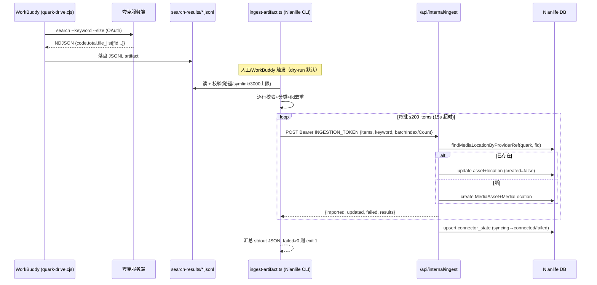

# WorkBuddy ↔ Nianlife 集成交接文档（WorkBuddy 侧）

> **2026-08-31 后续更新**：Quark artifact P0 安全修复（`.gitignore` 覆盖 WorkBuddy 运行时目录 + Windows reparse-point 防护）已完成，对应提交 `b161338`。Gemini Organizer V2 provider 已审计、整理并验证，对应提交 `5a444a2`（与本文档主题无关，一并记录方便对照时间线）。文档主体仍是审计时点的快照，最新事实以 Git 历史和 [`CLAUDE.md`](../CLAUDE.md) 为准。
>
> **文档性质声明**：本文是**可观察行为和集成契约审计**，不是完整的 WorkBuddy 源码审计。
> WorkBuddy 完整源码、测试与 Git 历史在当前环境**不可访问**（情况 B）。文中所有关于 WorkBuddy 内部实现的结论均标注证据来源：
> - **[DOC]** 来自官方 SKILL.md / references / install.sh / README 等文档；
> - **[OBS]** 来自本轮实际执行的命令输出（CLI version/help、auth 状态、只读 smoke、单元测试、typecheck）；
> - **[N/A]** 无法确认，不做猜测。
>
> Nianlife 侧代码可直接访问，其结论均为源码级。

---

## 1. 文档用途和审计范围

本文档面向 Claude Code（Nianlife 仓库侧的开发代理），用于：

- 理解 WorkBuddy 在 Nianlife 集成架构中的职责边界；
- 理解 Quark Connector（夸克网盘 Skill CLI）的安装、授权、搜索与 artifact 契约；
- 了解哪些集成链路已完成、哪些未验证或已知存在问题；
- 在修改任一侧代码时，明确不可破坏的兼容性约束。

**审计范围**：`C:\Users\teddy\Documents\Nianlife`（Nianlife 仓库）+ `.github/skills/quarkclouddrive/`（官方 Quark Skill 安装目录）+ WorkBuddy 安装环境的可观察面（CLI、Skill、授权状态）。

**不在范围**：WorkBuddy 应用本体源码、WorkBuddy 云端服务实现、夸克服务端实现。

**本轮零写操作**：未修改 WorkBuddy 或 Nianlife 业务代码、未升级依赖/CLI、未 commit/push、未对夸克网盘做任何写操作（上传/移动/删除/整理均未执行）、未输出任何凭据值。

## 2. 当前快照

| 项目 | 值 | 证据 |
|---|---|---|
| 审计日期 | 2026-08-29 ～ 2026-08-30 | — |
| 工作目录 | `C:\Users\teddy\Documents\Nianlife` | — |
| 项目身份 | Nian Life Journey（V2 数字人生档案，Next.js + drizzle） | AGENTS.md |
| 是否完整 WorkBuddy 源码仓库 | **否**（情况 B：只有已安装的 CLI / Skill / 运行环境） | — |
| 当前分支 | `feat/ai-organizer-v1` | `git branch --show-current` |
| 当前 commit | `a8d07d9b4ca2818693b21da871a44b0e81a9d756`（"feat: ingest WorkBuddy Quark artifacts"） | `git rev-parse HEAD` |
| 工作区未提交改动 | 有：`v2/.env.example`、`v2/lib/organizer/*`（6 个修改 + 2 个未跟踪文件，均属 AI organizer 线，与 Quark 集成无关）；未跟踪 `docs/CLAUDE_CODE_HANDOFF.md` | `git status --short` |
| Quark CLI 版本 | `1.0.15-1b5a657`，**经与官方远端 zip 逐字节比对确认为最新版** | [OBS] |
| Node 运行时 | 默认 shell node `v22.22.2`；系统另有 `v24.15.0`（`C:\Program Files\nodejs\node.exe`） | [OBS] |
| 包管理器 | npm（`package-lock.json`） | [OBS] |
| 已安装 Skill | 项目级 `.github/skills/quarkclouddrive`（官方 Quark Skill 1.0.15）；AGENTS.md 另记 `brainstorming` 已核验 | — |
| Connector 状态 | Quark 集成走 **Skill + CLI**（非 MCP connector）；WorkBuddy 已连接的 MCP connector 中与本项目相关的为 agent-mail，其余均断开 | connector 状态面板 |
| Nianlife 仓库可访问 | 是 | — |
| 授权状态 | **已登录**（`get-user-info` 返回 `code:0`，仅提取 code 字段，未输出账号数据） | [OBS] |

### Git 相关检查结果

- `git status --short --branch`：分支 `feat/ai-organizer-v1`，脏文件均为 AI organizer 线，Quark 集成相关文件全部干净。
- 与 Quark / artifact / connector / ingest / workbuddy / media 相关的提交：`a8d07d9 feat: ingest WorkBuddy Quark artifacts`（当前 HEAD，包含 v2 侧完整 ingestion 链路）。
- 未执行任何破坏性 Git 命令。

### 本次审计实际检查的内容

- Quark Skill 全部 13 个 git 跟踪文件（SKILL.md、9 个 references、install.sh、quark-drive.cjs 未读源码仅用其 CLI 接口、hash-worker.cjs 仅确认存在）；
- Nianlife v2 侧 Quark 集成全部代码文件（tools/quark-connector/ 5 个、lib/ingest/ 3 个、lib/archive/quark-archive.ts、app/api/internal/ingest/route.ts、drizzle/0003 迁移、2 个测试文件）；
- .gitignore 覆盖情况、CLI help/版本、auth 状态、单元测试、typecheck、install.sh 行为、只读 search/qa smoke（前几轮会话）。

### 未能检查的内容及原因

- WorkBuddy 应用源码（不可访问）；
- `quark-drive.cjs` 内部实现（按约束禁读源码，只测 CLI 接口）；
- `workbuddy/config.json` 内容（凭据文件，按约束禁读，仅确认存在性与 git-ignore 状态）；
- 夸克服务端人物识别行为（smoke 命中 0 条，无法观察）。

## 3. 给 Claude Code 的 5 分钟摘要

1. **架构分工**：WorkBuddy 是唯一被允许调用 Quark CLI 的执行方。Nianlife v2 代码中 `QuarkCliAdapter` **故意抛出 `QUARK_CAPABILITY_UNSUPPORTED`**——这是项目约定，不是待实现的 TODO。Nianlife 只消费 WorkBuddy 产出的 JSONL artifact。
2. **数据流**：WorkBuddy 跑 `search`（语义关键词检索）→ 结果落盘 `scripts/search-results/*.jsonl` artifact → 人工/WorkBuddy 调 `v2/tools/quark-connector/ingest-artifact.ts` → 校验/映射 → HTTP POST 批量提交到 `/api/internal/ingest`（Bearer INGESTION_TOKEN）→ 幂等 upsert `MediaAsset` + `MediaLocation`。
3. **已验证可用**：CLI 安装、授权、搜索 envelope、artifact 校验/去重/分类过滤、HTTP 批量 ingestion、幂等键（quark providerRef = fid）、401 防护。typecheck 通过。
4. **已知问题**（详见 §16/§17/§19）：① 默认 Node 22 下 5/15 测试因 tsx 模块双实例失败（Node 24 通过，除 1 个）；② Windows 上 symlink 护栏失效（`lstatSync().isSymbolicLink()` 对本机 symlink 返回 false）；③ install.sh 在 Git Bash 下误判需更新且下载失败（MSYS 路径问题，无害但每次调用报错）；④ 人物语义检索（"张小年/张年"）命中 0 条，未验证。
5. **红线**：不要让 Nianlife 直接调 CLI；不要把 `big_thumbnail`/`check_link` 存为永久 MediaLocation（临时 URL）；不要改变 artifact 字段契约与幂等键；凭据文件 `workbuddy/config.json` 已被 git-ignore，保持如此。

## 4. WorkBuddy 的定位和职责

| 问题 | 回答 | 证据 |
|---|---|---|
| WorkBuddy 是什么 | **多种能力的组合**：桌面端 AI 助手应用（含 agent loop、任务管理、记忆系统）+ Agent Skill 平台 + MCP Connector 平台。Quark 集成走「项目级 Skill + CLI」通道 | [OBS] 环境结构 |
| 哪些事由 WorkBuddy 负责 | 执行 Quark CLI（login/search/summary/qa/download 等）、产出 search artifact、在对话中按官方 SKILL.md 约束操作网盘 | [DOC] SKILL.md |
| 哪些事必须由 Nianlife 负责 | artifact 的读取、校验、schema 映射、幂等持久化、业务对象（MediaAsset/MediaLocation/Media）创建、后续 organizer 流程 | [OBS] v2 源码 |
| WorkBuddy 是否直接写 Nianlife 数据库 | **否**。没有任何直连 DB 的路径 | [OBS] 无相关代码；WorkBuddy 只产出文件与对话 |
| 是否只生成 artifact、由 Nianlife 读取持久化 | **是**（针对照片元数据导入链路） | [OBS] v2/tools/quark-connector/ingest-artifact.ts |
| WorkBuddy 是否保存业务状态 | 保存**授权凭据**（`workbuddy/config.json`）与**搜索 artifact 文件**；不保存 Nianlife 业务状态。Nianlife 的导入状态存在自己的 `connector_state` 表 | [OBS] route.ts 中 upsertConnectorState |
| 外部文件的真实来源、元数据、内容在哪 | 字节在夸克云；元数据在 artifact（fid/filename/size/时间戳/缩略图 URL）；Nianlife 本地只存元数据 + 可选衍生物（hot storage） | [OBS] |
| Nianlife 不可用时 WorkBuddy 留下什么 | 磁盘上的 search artifact JSONL 文件（不提交、可重放） | [DOC]+[OBS] |
| WorkBuddy 不可用时 Nianlife 能否运行 | **能**。已导入数据完整；仅新导入暂停 | [OBS] 架构 |
| 是否存在职责重叠/循环依赖 | **无**。边界清晰：WorkBuddy=CLI 执行者+artifact 生产者；Nianlife=artifact 消费者。唯一灰色地带：`ingest-artifact.ts` 放在 Nianlife 的 `tools/` 里但由谁触发未定（见 §24） | [OBS] |

### 职责划分表

| 能力 | WorkBuddy 负责 | Nianlife 负责 | 当前证据 | 尚未确认 |
|---|---|---|---|---|
| Quark CLI 调用（login/search/qa） | ✅ 唯一执行方 | ❌ 显式禁止（adapter 抛错） | cli-adapter.ts | — |
| 搜索 artifact 生成 | ✅ 落盘 search-results/*.jsonl | 读取 | [DOC] file-search.md | artifact 文件名规则细节 |
| artifact 校验/映射 | — | ✅ processQuarkArtifactLines | lib/ingest/quark-artifact.ts | — |
| 幂等持久化 | — | ✅ upsert by providerRef | quark-artifact-asset.ts | — |
| 媒体字节下载 | ✅ download 命令 | 可选（ingestQuarkFile 支持注入 client） | [DOC]+[OBS] | 生产中由谁触发 |
| 授权管理 | ✅ config.json + OAuth | — | auth.md | 刷新机制细节 |
| 导入进度/状态 | — | ✅ connector_state 表 | route.ts | — |
| 人物语义检索 | ✅（理论，search 语义模式） | ❌ | [OBS] smoke 命中 0 | **服务端是否真的支持** |

## 5. WorkBuddy 与 Nianlife 的边界

（已并入 §4 表格。核心边界一句话：**WorkBuddy 负责网盘侧的一切操作与 artifact 生产；Nianlife 负责从 artifact 之后的一切。两者之间唯一的契约面是：(a) JSONL artifact 文件格式，(b) 可选的 HTTP ingestion API。**）

## 6. 组件、Skill 和 Connector 清单

### Quark Skill（`.github/skills/quarkclouddrive/`，git 跟踪的 13 个文件）

| 文件 | 用途 | 覆盖标记 |
|---|---|---|
| `SKILL.md` | 官方能力总览、约束（每次调用前跑 install.sh、错误处理规范） | 已逐文件检查 |
| `references/auth.md` | 授权生命周期 | 已逐文件检查 |
| `references/file-search.md` | 搜索契约（本次集成核心） | 已逐文件检查 |
| `references/assistant.md` | summary/qa（内容理解） | 已逐文件检查 |
| `references/file-ops.md` / `file-organize.md` / `file-read.md` / `file-saveas.md` / `file-share.md` / `file-upload.md` | 写操作类（本集成禁用） | 仅检查存在性（与照片导入无关） |
| `scripts/install.sh` | 安装/更新脚本 | 已逐行检查（见 §8） |
| `scripts/quark-drive.cjs` | CLI 本体 | **禁读源码**，仅验证 CLI 接口 |
| `scripts/hash-worker.cjs` | 下载分块校验辅助 | 仅检查存在性 |
| `scripts/uninstall.sh` | 卸载 | 仅检查存在性 |

### 非跟踪的运行时文件

| 路径 | 内容 | git-ignore |
|---|---|---|
| `workbuddy/config.json` | 授权凭据 | ✅ 已忽略（.gitignore 第 5 行） |
| `workbuddy/storage/` | 运行时存储（当前为空目录） | ❌ **未忽略** |
| `scripts/search-results/` | 搜索 artifact 落盘目录（当前为空） | ❌ **未忽略**（见 §18 风险） |

### CLI 命令面（`--help` 实测，[OBS]）

```
login | unauthorize | logout | upload | share | create-folder | move |
share-detail | share-search | saveas | search | summary | qa |
organize | organize-copy | organize-move | download | update |
get-user-info | resolve-agent
```

本集成只允许使用：`login`、`get-user-info`、`search`、（未来）`download`。其余命令（尤其 upload/move/organize 系列）属于写操作，照片导入流程禁用。

## 7. Quark Connector 架构

```
┌─────────────┐   OAuth    ┌──────────────┐
│  WorkBuddy   │──────────▶│  夸克网盘 API │
│ (Skill+CLI)  │◀──────────│   (服务端)    │
│              │  NDJSON     └──────────────┘
│ quark-drive  │
│ .cjs search  │──▶ scripts/search-results/*.jsonl  (artifact)
└──────┬───────┘
       │ 人工 / WorkBuddy 触发
       ▼
┌────────────────────────────────────────────────┐
│ Nianlife v2                                     │
│ tools/quark-connector/ingest-artifact.ts        │
│  ├─ readQuarkArtifactLines (路径/symlink/扩展名护栏) │
│  ├─ processQuarkArtifactLines (校验+分类+去重)    │
│  └─ POST /api/internal/ingest (Bearer token, 分批) │
│       └─ lib/ingest/quark-artifact-asset.ts     │
│            └─ MediaAsset + MediaLocation upsert │
│                 (幂等键: provider="quark" + providerRef=fid) │
└────────────────────────────────────────────────┘
```

注意：`lib/ingest/quark.ts` 中的 `ingestQuarkFile()`（完整导入：含下载字节、创建 RawSource/Media/derivatives/organizer）是**另一条链路**（HTTP API 的 `file` 模式），照片 artifact 批量导入不经过它。

## 8. 安装和版本机制

| 问题 | 结论 | 证据 |
|---|---|---|
| 每次调用前是否必须跑 install.sh | **是**（SKILL.md 明确要求） | [DOC] |
| install 的真实作用 | 检查 Node 环境（≥某版本）→ 探测本地 CLI 版本 → 与 SKILL.md 记录版本比对 → 不一致则下载官方 zip 覆盖安装 | [OBS] 逐行读脚本 |
| 如何判断需要升级 | 比对 `node quark-drive.cjs --version` 提取的 semver 与 SKILL.md 头部版本 | [OBS] |
| 升级失败是否继续用本地版本 | **是**（下载失败不删除现有 CLI，安全回退） | [OBS] 本轮即发生 |
| 下载/安装路径 | zip 源 `https://pdds.quark.cn/download/stfile/.../quarkclouddrive-<ver>.zip`，解压覆盖到 skill 目录 | [OBS] |
| 版本不匹配会导致什么 | 理论上 SKILL.md 文档与 CLI 行为漂移；当前已验证一致 | [OBS] |
| 已知安装失败 | **install.sh 在 Git Bash 下必失败**（见下） | [OBS] |

**已发生的失败（根因已定位）**：本机 Git Bash 对原生 Windows 程序（node/curl）**不做 MSYS→Windows 路径转换**。install.sh 内部用 `/c/Users/...` 形式路径调 node 和 curl：
- node 报 `Cannot find module 'C:\c\Users\...'` → 版本探测返回空 → 误判"需要更新"；
- curl 写文件报 **error 23**（写入失败）→ 更新必然失败。
用 `C:/...` 风格路径手动执行同一下载**成功**，且远端 zip 与本地 CLI **逐字节一致（仅换行符差异）**——本地已是最新版 1.0.15-1b5a657。
**影响**：无（本地即最新）；但每次 install.sh 都会报"更新失败"噪音。**修复属 WorkBuddy/Skill 侧**（或换 PowerShell/WSL 执行），Nianlife 侧无需动作。

## 9. 授权生命周期

| 问题 | 结论 | 证据 |
|---|---|---|
| 如何检查登录状态 | `quark-drive.cjs get-user-info`，成功返回 `code:0` | [OBS] |
| 首次登录流程 | `login` 命令 → 自动打开浏览器 OAuth → 用户确认 → 凭据写入 `workbuddy/config.json` | [DOC]+[OBS]（本轮亲测成功） |
| 授权过期表现 | `code: -103 未登录，请先执行 login 命令完成登录授权` | [OBS] |
| 凭据保存位置/权限 | `workbuddy/config.json`，**已被 .gitignore 覆盖**；具体内容按约束未读取 | [OBS] |
| 是否支持自动刷新 | 未知（CLI 内部行为，源码禁读） | [N/A] |
| 登录失败如何恢复 | 重新跑 `login`（本轮实测：-103 后重 login 成功） | [OBS] |
| 哪些操作需人工参与 | 浏览器 OAuth 授权确认 | [OBS] |
| 如何撤销授权 | `unauthorize`（解除授权）；`logout` 仅卸载时用 | [DOC] |
| 不同环境是否共享授权 | 否。凭据是本机文件；CI/新机器需重新 login | [OBS] 推断自文件位置 |
| CI/开发/生产建议 | **不要在 CI 存凭据**。导入应由持有授权的开发机（或 WorkBuddy 会话）产出 artifact，CI 只消费 artifact fixture | 本审计建议 |
| 当前状态 | ✅ 已登录（2026-08-29 重新授权） | [OBS] |

## 10. 搜索命令及返回契约

### 命令与参数

```
quark-drive.cjs search --keyword <语义关键词> --size <1-3000>
                        [--session-id <id>] [--session-input <原始用户输入>]
```

- keyword 是**语义检索**输入（官方称支持自然语言语义，非纯文件名匹配），但实测人物名命中依赖服务端能力（见 §16 smoke）。
- `--size` 上限 3000，与服务端 `total` 对应。

### 返回 envelope（NDJSON / JSON，[OBS] 实测）

```json
{"code":0,"msg":"成功","data":{"total":0,"file_list":[]}}
```

有结果时 `file_list` 每项字段（[DOC] file-search.md + v2 校验器交叉印证）：

| 字段 | 类型 | 说明 |
|---|---|---|
| `fid` | string | **稳定文件 ID（幂等键来源）** |
| `parent_fid` | string | 父目录 ID |
| `filename` | string | 文件名 |
| `size` | number? | 字节 |
| `category` | int | 0 文件夹 / 1 视频 / 2 音频 / 3 照片 / 4 文档 / 5 种子 / 6 其他 / 7 压缩包 / 8 应用 |
| `file_type` | string | — |
| `format_type` | string | MIME（v2 用作 mimeType） |
| `obj_category` | string | — |
| `created_at` | number | Unix 时间戳（秒或毫秒，v2 做了自适应） |
| `updated_at` | number | 同上 |
| `file` | boolean | 是否文件 |
| `path` | string | 所在目录路径 |
| `big_thumbnail` | string? | **临时缩略图 URL** |
| `check_link` | string? | 临时链接 |

### 关键契约行为

- **"0 条结果"≠"失败"**：`code:0` + `total:0` 是成功；`code:-103` 是未登录；`code:-1504` 是参数缺失。按官方约束**不允许 0 结果后自动换词重搜**。
- 排序/分页：服务端返回；无显式 `--sort` 参数（[OBS] help 中未见）。
- **无 EXIF 拍摄时间字段**：`created_at/updated_at` 是文件时间，不是拍摄时间。
- 搜索副作用：无（纯读）。
- **assistant 契约**（重要负结论）：`summary`/`qa` 强制要求 `--fid-list`（缺省返回 `code:-1504`，本地参数校验即拒绝，未触达服务端）；返回只有 `text_block` 文本，**不存在"按人物检索并返回 fid 列表"的 assistant 入口**。人物检索唯一入口是 `search`。

## 11. Artifact Schema 和示例

- **谁生成**：Quark CLI 的 `search` 命令（全量结果自动落盘）。
- **写到哪**：`<skill>/scripts/search-results/`（目录实测存在，当前为空——本轮搜索 0 结果不落盘）。
- **格式**：JSONL，**一行 = 一个文件（BrowseFileItem）**，字段同 §10 表格。
- **空结果**：实测 0 结果时**不产生 artifact 文件**（以"无文件"表达空）。
- **Schema 版本号**：**无**（官方文档未见 schema version 字段，见 §19 风险）。
- **v2 侧校验器**（`lib/ingest/quark-artifact.ts`，权威 schema 镜像）：
  - 必填：`fid`、`filename`、`category`(0-8 int)、`parent_fid`(string)、`file_type`(string)、`file`(bool)、`format_type`(string)、`obj_category`(string)、`created_at`/`updated_at`(safe int)、`path`(string)；
  - 可选：`size`、`big_thumbnail`、`check_link`、`includeItems`；
  - **fid 与 filename 拒绝控制字符/路径穿越**；artifact 文件路径必须**绝对路径 + .jsonl 扩展名 + 非 config.json + 非 symlink + 常规文件**；
  - **上限 3000 行**（`QUARK_ARTIFACT_MAX_ITEMS`），超出整体拒绝；
  - `big_thumbnail`/`check_link` 在映射时**故意丢弃**（临时 URL 不得成为永久 location）；`capturedAt`/`checksum` 恒为 null（无 EXIF、不读字节）。

**脱敏最小示例**（字段结构示意，非真实数据）：

```jsonl
{"fid":"<opaque-id>","parent_fid":"<opaque-id>","category":3,"filename":"IMG_0001.jpg","size":123456,"file_type":"image","format_type":"image/jpeg","obj_category":"图片","created_at":1780000000,"updated_at":1780000000,"file":true,"path":"/photos/2026/01","big_thumbnail":"https://...","check_link":"https://..."}
```

## 12. 幂等、重试和文件生命周期

| 问题 | 结论 | 证据 |
|---|---|---|
| 稳定身份 | `fid`（CLI 服务端 ID） | [DOC]+[OBS] |
| 重复搜索产生重复 artifact | 会产生**新文件**（每次 search 落盘），但内容行可重复 | [DOC] |
| Nianlife 幂等键 | `(provider="quark", variant="original", providerRef=fid)`，查 `findMediaLocationByProviderRef` → 存在则 update（created:false），不存在则 create | quark-artifact-asset.ts |
| artifact 内去重 | `processQuarkArtifactLines` 用 `seen` Set 按 fid 去重，重复行标 `duplicate_in_artifact` skip | 同上 |
| 重命名/移动后身份 | **fid 不变**（服务端 ID），但 `path`/`parent_fid` 变化 → v2 更新 location 的 path 快照字段（`quarkPathSnapshot`、`sourceParentRef`） | [OBS] upsert 逻辑 |
| 内容变化识别 | artifact 链路**不读字节**，无法识别内容变化（仅元数据字段更新） | 代码注释明示 |
| 重放 artifact | 安全：幂等 upsert，重复导入=更新元数据，不产生重复资产 | [OBS] 测试覆盖 |
| 导入失败记录 | connector_state 表：`failedCount`、`lastErrorCode`、`lastError`、批次状态 `syncing/connected/failed` | route.ts |
| 去重/合并职责 | 去重在 Nianlife（fid 幂等）；合并业务对象（Media/RawSource）也全在 Nianlife | [OBS] |
| 断点恢复 | **部分支持**：批次级（batchIndex/batchCount）+ 幂等 upsert 使重试安全；但无自动 checkpoint，需整体重跑（幂等保证正确性） | [OBS] |
| artifact 保留策略 | **无自动清理**；Nianlife 侧读后不删 | [OBS] |

## 13. Nianlife 端到端接入链路

实际代码名（以源码为准）：

```
WorkBuddy 会话（quark-drive.cjs search）
  → scripts/search-results/<artifact>.jsonl          [生产者落盘]
  → v2/tools/quark-connector/ingest-artifact.ts      [Nianlife 消费者入口，本地 CLI 工具]
      --artifact <绝对路径> --keyword <≤50字符> [--commit] [--batch-size 1-200] [--profile-id]
      默认 dry-run；--commit 需 NIANLIFE_INGESTION_URL + INGESTION_TOKEN 环境变量
  → lib/ingest/quark-artifact.ts                     [校验/分类/去重/映射]
  → POST /api/internal/ingest (Bearer INGESTION_TOKEN, 15s/批, ≤200 items/批)
  → lib/ingest/quark-artifact-asset.ts               [幂等 upsert]
  → MediaAsset + MediaLocation(provider="quark")     [领域对象]
  → connector_state                                  [导入状态]
  → （后续：AI Organizer / Media 展示——另一条链路，ingestQuarkFile 的 file 模式或人工流程）
```

| 关注点 | 行为 | 证据 |
|---|---|---|
| 空结果 | `processQuarkArtifactLines` 返回空 imported；commit 模式下提交 1 个空 finalization 批次（batchIndex=0, batchCount=1）合法 | route.ts L79 |
| HTTP 失败 | 整批计为 failed，`lastErrorCode: HTTP_<status>`，**绝不误判为成功**；exit code 1 | ingest-artifact.ts L75 |
| 超时 | 15s/批 AbortController，计 `NETWORK_ERROR` | 同上 |
| 无效响应 | 计数校验失败即 `INVALID_RESPONSE` 整批失败 | parseBatchOutcome |
| 无效 JSONL 行 | **隔离不中断**：记入 `invalid[]`（行号+原因），不影响其他行 | quark-artifact.ts |
| 不支持类目 | skip（`unsupported_category`），仅 category 1(视频)/3(照片) 导入 | 同上 |
| 部分成功 | 返回逐条 results（imported/updated/failed），failedCount 累计入 state | route.ts |
| 重试安全性 | ✅ 幂等 upsert；重试=更新 | [OBS] |
| 孤儿/中间状态 | 批次中途失败 → connector_state 停在 `syncing`；重跑全量恢复 | [OBS] 推断 |
| 日志关联 | **弱**：`keyword` + `connectorVersion: quark-artifact-ingest/0.1`；无跨进程 trace ID | [OBS]（见 §19） |

### 端到端时序图



## 14. 跨项目 Contract 表

| 契约项 | WorkBuddy 当前行为 | Nianlife 的预期 | 证据路径 | 兼容性要求 | 修改影响 |
|---|---|---|---|---|---|
| CLI 命令 | `search --keyword --size` | 只消费其产物 | scripts/quark-drive.cjs --help | CLI 只能由 WorkBuddy 调用 | Nianlife 不得新增 CLI 调用路径 |
| 命令参数 | `--keyword`（语义）、`--size 1-3000`、`--session-id` | — | 同上 | size ≤3000 | 超限将被 v2 拒收 |
| exit code | 0 成功；1 失败（v2 工具） | ingest-artifact failed>0 → exit 1 | tools/quark-connector/ingest-artifact.ts | — | — |
| stdout/stderr | NDJSON envelope；v2 工具 stdout=汇总 JSON、stderr=错误 JSON | 结构化解析 | 同上 | stdout 必须保持单行 JSON | 增字段向后兼容，删/改字段破坏 |
| 顶层响应 | `{code, msg, data:{total, file_list}}` | — | [OBS] smoke | code:0=成功 | 错误码变更需同步 v2 映射 |
| artifact 路径 | `<skill>/scripts/search-results/*.jsonl` | ingest-artifact `--artifact` 传绝对路径 | [DOC]+[OBS] | — | 目录迁移需改文档约定 |
| artifact Schema | §11 字段 | quark-artifact.ts 校验器为镜像 | lib/ingest/quark-artifact.ts | **必填字段集与类型不可破坏** | 双侧同步改 |
| 空结果 | code:0 total:0，**不落盘文件** | ingest-artifact 对不存在文件报错 | [OBS] | 空结果需人工确认非故障 | — |
| 部分成功 | —（CLI 层无此概念） | 逐条 results + state 计数 | route.ts | — | — |
| 错误码 | CLI: -103 未登录 / -1504 参数缺失 | v2 映射: QUARK_AUTH_REQUIRED 等 | lib/ingest/quark.ts | 新 CLI 错误码需映射 | 否则落入 QUARK_COMMAND_FAILED |
| 登录失效 | code:-103 | isQuarkAuthError 按码+消息正则识别 | 同上 | -103 语义不可变 | — |
| 超时 | CLI 侧未知 | 15s/批（v2 工具） | ingest-artifact.ts | — | — |
| 重试 | 官方禁止 0 结果换词重搜 | 幂等 upsert 使重试安全 | [DOC]+[OBS] | — | — |
| 幂等键 | fid（服务端稳定 ID） | (provider,variant,providerRef)=(quark,original,fid) | quark-artifact-asset.ts | **fid 语义不可变** | 变更=全量重复导入 |
| 文件生命周期 | 重命名/移动 fid 不变，path 变 | 更新 path 快照字段 | [OBS] | — | — |
| Schema 版本 | 无版本字段 | 校验器内嵌于代码 | quark-artifact.ts | **CLI 字段演进无协商机制** | 见 §19 风险 |
| 日志关联 | `--session-id`（CLI 级） | keyword + connectorVersion | 双侧 | 无共享 trace ID | 见 §19 |
| 凭据/runtime | workbuddy/config.json（已 ignore） | v2 侧用 INGESTION_TOKEN（环境变量） | .gitignore / .env.example | **凭据不得入库**；INGESTION_TOKEN 不得硬编码 | — |

## 15. 已完成、部分完成和未完成能力

图例：✅ 已完成并验证 / 🟡 已实现未完全验证 / 🟠 部分完成 / 🔴 未完成 / ⚪ 无法确认 / 🗑️ 废弃

| 能力 | 状态 | 已完成 | 缺失 | 代码/文档证据 | 测试证据 | 风险 |
|---|---|---|---|---|---|---|
| Quark Skill 安装/更新 | ✅ | CLI 1.0.15 最新且可用 | install.sh Git Bash 兼容（噪音） | [OBS] zip 比对 | — | 低 |
| 授权生命周期 | ✅ | login/OAuth/状态检查/撤销 | 刷新机制未知 | auth.md | [OBS] 实测 | 低 |
| search 命令 | ✅ | 语义搜索、envelope、artifact 落盘 | 人物维度命中 | file-search.md | [OBS] smoke | 中 |
| **人物语义检索** | ⚪ | —（通道存在） | 服务端是否识别"张年"未验证；实测关键词命中 0 | smoke 结果 | 0 命中 | **高**（核心需求依赖） |
| assistant 人物检索入口 | ✅（负结论） | 已实证**不存在**该入口 | — | [OBS] -1504 | [OBS] | — |
| artifact 校验/分类/去重 | ✅ | 全字段校验+护栏 | Node22 下测试环境问题 | lib/ingest/quark-artifact.ts | 单测（Node24 通过） | 低 |
| HTTP ingestion API | ✅ | 认证/校验/批量/幂等/状态 | — | app/api/internal/ingest/route.ts | 单测 | 低 |
| MediaAsset/MediaLocation 幂等持久化 | ✅ | upsert by fid | — | quark-artifact-asset.ts | 单测 | 低 |
| 空 artifact 安全处理 | ✅ | 空 finalization 批次合法 | 无文件落盘时消费端报错（需人工区分"空 vs 故障"） | route.ts L79 | 部分 | 低 |
| HTTP 失败上报 | ✅ | 整批 fail，不误判成功 | — | ingest-artifact.ts | 单测 | 低 |
| 无效 JSONL 行隔离 | ✅ | invalid[] 隔离 | — | quark-artifact.ts | 单测 | 低 |
| 凭据 git-ignore | ✅ | config.json 已忽略 | workbuddy/storage、search-results 未忽略 | .gitignore | [OBS] | 中 |
| symlink 护栏 | 🟠 | 代码存在 | **Windows 上实测失效**（见 §16） | quark-artifact.ts L87 | 实测失败 1 例 | 中 |
| 真实端到端导入（真实照片） | 🟡 | 代码全通 | 从未用真实 artifact 走通 commit 全流程 | — | 无 | 中 |
| 媒体字节下载归档链路 | 🟡 | ingestQuarkFile+download 实现 | 未在真实流程验证 | lib/ingest/quark.ts | 部分 | 中 |
| QuarkCliAdapter（v2 调 CLI） | 🗑️ 按设计 | 故意抛 QUARK_CAPABILITY_UNSUPPORTED | — | cli-adapter.ts | [OBS] | —（红线） |
| CLI 只经 WorkBuddy 调用 | ✅ | v2 无任何 spawn CLI 代码 | — | [OBS] 全库检索 | — | — |
| contract smoke 覆盖真实命令 | 🟡 | search/qa/login 已 smoke | 真实非空 artifact 未获得 | 会话记录 | — | 中 |
| 只有 mock 测试？ | 否——ingestion 逻辑为真实实现+fixture 单测；但**无真实网盘数据回归** | | | | | |

## 16. 测试和 smoke 结果

### 实际执行的验证命令（全部只读）

| 命令 | 结果 | 证明 / 不能证明 |
|---|---|---|
| `node scripts/quark-drive.cjs --version` / `--help` | `1.0.15-1b5a657`；23 个命令 | 证明 CLI 完整可用 / 不证明服务端能力 |
| `node scripts/quark-drive.cjs get-user-info`（仅提取 code） | `code:0` | 证明授权有效 / 不证明网盘内容 |
| `bash scripts/install.sh` | 环境检查过；更新模式失败（MSYS 路径，§8） | 证明已知噪音 / 不影响本地 CLI |
| `search --keyword "张小年或张年" --size 20`（前轮） | `code:0, total:0, file_list:[]`，无 artifact 落盘 | 证明链路与 envelope / **不证明**人物检索可用 |
| `qa --query <自然语言>`（前轮） | `code:-1504 缺少 fid-list`（本地拒绝） | 证明 assistant 无人物检索入口 |
| `npm run typecheck`（v2） | **通过** | 类型完整性 |
| `node --import tsx --test test/quark-artifact-ingest.test.mjs test/quark-connector.test.mjs` | **Node 22（默认）：5/15 失败**；**Node 24：connector 4/4 通过，artifact-ingest 仅 symlink 用例失败** | 见下 |
| 手工 symlink 复现实验 | `fs.symlinkSync` 创建后 `lstatSync().isSymbolicLink()` 返回 **false** | 见下 |

### 三个确定性测试发现（均属环境/平台问题，非逻辑缺陷）

1. **Node 22 下 5 个测试失败**：`instanceof QuarkAdapterError` 为 false——`.ts` 扩展名 specifier 与无扩展名 specifier 被 tsx 解析为**两个模块实例**（双实例问题）。Node 24 下同类断言通过。已用诊断脚本实证错误对象本身正确（code 正常）。
2. **symlink 护栏被 Windows 击穿**：`ingest-artifact CLI rejects symlink artifacts`（test L164）失败，因为本机 `fs.symlinkSync()` 创建的链接经 `lstatSync().isSymbolicLink()` 检测为 **false**（Windows 权限/ Junction 行为）。护栏代码正确，平台行为异常。**安全影响**：攻击面收窄为"本地已能写文件系统并构造 symlink 指向敏感文件"的场景，风险有限但应修复（如改用 `realpath` 比对或 `fs.statSync` follow 后校验）。
3. **install.sh Git Bash 路径问题**（§8，属 Skill 侧）。

### 各问题归类

- 代码问题：symlink 检测策略（中危）
- 环境问题：Node22 tsx 双实例（建议 v2 固定 Node ≥24 或统一 specifier 风格）
- 网络/授权问题：无（本轮授权正常）

## 17. 已知故障与恢复手册

| 故障 | 表现 | 恢复步骤 | 证据 |
|---|---|---|---|
| 授权过期 | CLI 返回 `code:-103` | 运行 `quark-drive.cjs login`（浏览器 OAuth，需人工）；**自动化流程不得自动重登** | [OBS] |
| install.sh 报更新失败 | curl error 23 / node Cannot find module | 忽略（本地已最新）；如确需更新，在 PowerShell/WSL 下跑或手动 `curl -o C:/... .zip` 解压覆盖 | [OBS] |
| search 返回 total:0 | 无 artifact 文件 | 先确认非故障（code:0）；**禁止自动换词重搜**；人工核实关键词/账号智能搜索开通状态 | [DOC] |
| ingest-artifact exit 1 | stderr JSON `{ok:false,error:{code...}}` | 看 `lastErrorCode`：HTTP_4xx=配置/认证 → 检查 INGESTION_TOKEN/URL；NETWORK_ERROR=网络；QUARK_ARTIFACT_INVALID=artifact 损坏 | [OBS] 源码 |
| connector_state 卡 syncing | 批次中断 | 直接重跑 ingest-artifact --commit（幂等安全） | [OBS] |
| QUARK_ARTIFACT_TOO_LARGE | >3000 行 | 拆分 artifact 或分多次 search | 源码 |
| 测试在 Node22 失败 | instanceof 断言失败 | 用 Node 24 跑，或修 specifier | [OBS] |

## 18. 安全和隐私

| 检查项 | 结论 | 证据 |
|---|---|---|
| 凭据进 Git | **已防护**：config.json 被 .gitignore L5 覆盖；skill 目录 git status 干净 | [OBS] check-ignore |
| runtime 文件忽略 | ⚠️ `workbuddy/storage/` 与 `scripts/search-results/` **未忽略**（当前为空）。一旦产生 artifact（含私人照片文件名、缩略图 URL），**可能被误提交** | [OBS] |
| artifact 含敏感信息 | 是：文件名、路径、缩略图/下载临时 URL | [DOC] |
| 日志泄漏 | v2 工具 stdout 含 filename 与 fid；**不含凭据**。Quark CLI 内部日志未审计（源码禁读） | [OBS] |
| 未成年人照片风险 | **高优先**：artifact 携带儿童照片元数据；AGENTS.md 要求按敏感数据处理。建议 (a) .gitignore 增加 `search-results/`，(b) 导入后按项目隐私策略处理 | [OBS] |
| URL 长期有效性 | `big_thumbnail`/`check_link` 为**临时 URL**——v2 已正确丢弃，不得回流 | [OBS] 代码注释 |
| 路径遍历/任意写 | 已防护：绝对路径+扩展名+`..` 段拒绝+config.json 拒绝+symlink 检查（Windows 除外，见 §16.2）；fid/ filename 控制字符拒绝 | [OBS] |
| artifact 签名/加密 | **无**。当前信任模型=本机文件系统权限 | [N/A] |
| INGESTION_TOKEN | timingSafeEqual 比较，防时序攻击 ✅；不得硬编码/入库 | [OBS] |

## 19. 技术债、难点和风险

### 已经发生的问题（有实证）

| # | 问题 | 证据 | 当前实现 | 典型失败模式 | 建议 |
|---|---|---|---|---|---|
| 1 | 人物语义检索命中 0 | smoke total:0 | 无 | 网站核心需求"最近20张张小年照片"无法服务端筛选 | 先在夸克 App 相册命名人物+确认智能搜索开通后复测；备选=全量列表+本地排序（需重估"不遍历"约束） |
| 2 | install.sh Git Bash 失败 | curl 23 | 无修复 | 噪音+真需更新时受阻 | Skill 侧修路径转换；或文档注明 Windows 用 PowerShell |
| 3 | Node22 测试失败 | 5/15 fail | 无 | CI 若用 Node22 会假红 | v2 engines 固定 Node ≥24，或统一 import specifier |
| 4 | symlink 护栏 Windows 失效 | 测试+手工复现 | lstat 检查 | 本地攻击者借 symlink 读敏感文件 | 改 realpath 归一化比对 |
| 5 | search-results 未 gitignore | check-ignore 无匹配 | 无 | 私人照片元数据误提交 | **加 .gitignore 条目** |

### 推测的风险（无实证，标注原因）

| # | 风险 | 为什么难 | 尚未确定的决策 | 推荐方案 |
|---|---|---|---|---|
| 6 | **CLI 版本漂移破坏 artifact schema**（无版本号协商） | 官方 CLI 自更新，字段可能增删 | v2 校验器是否宽容（未知字段丢弃 vs 拒绝）→ 当前是丢弃未知字段，但**删字段会拒收整行** | ingest 侧加 schema 版本探测字段；contract 测试用 fixture 锁字段集 |
| 7 | 空结果 vs 故障歧义 | CLI 0 结果不落盘文件 | 消费端无文件时如何区分 | 约定空结果也写一个空 artifact（含 total:0 头）或由 WorkBuddy 会话显式确认 |
| 8 | 临时下载 URL 过期 | 夸克 URL 有效期未知 | 归档流程何时拉取字节 | v2 已丢弃 URL，正确；归档走 download 命令时取新链 |
| 9 | 跨进程日志关联弱 | 只有 keyword 弱关联 | 是否引入 trace ID | WorkBuddy 会话把 `--session-id` 写进 ingestion metadata（route 已有 batchIndex 等字段可扩展） |
| 10 | 本地可用但部署环境不可用 | 授权是本机文件 | 生产导入由谁执行 | 见 §24 决策 3 |
| 11 | 双仓契约漂移 | skill 在 Nianlife 仓库内（.github/skills）但由 WorkBuddy 生态更新 | 更新 skill 时是否同步 v2 校验器 | 更新 skill 后必跑 v2 quark 测试套件 |

## 20. P0–P3 后续路线图

### P0 — 凭据/数据安全（先做）

| 任务 | 当前基础 | 修改位置 | 依赖 | 验收标准 | 验证方式 | 工作量 | 不确定性 | 兼容风险 |
|---|---|---|---|---|---|---|---|---|
| .gitignore 增加 `search-results/` 与 `workbuddy/storage/` | .gitignore 已有 config.json 条目 | Nianlife | 无 | `git check-ignore` 命中两者 | 命令验证 | S | 低 | 无 |
| 修复 symlink 检测（realpath 比对） | 护栏代码在 | Nianlife v2 | 无 | Windows 下 symlink 用例通过 | 单测 | S | 低 | 无 |

### P1 — 核心导入闭环

| 任务 | 当前基础 | 修改位置 | 依赖 | 验收标准 | 验证方式 | 工作量 | 不确定性 | 兼容风险 |
|---|---|---|---|---|---|---|---|---|
| 复测人物检索（夸克 App 命名人物后） | smoke 脚本现成 | 无代码改动 | 人工在 App 命名+开通智能搜索 | "张年"关键词 total>0 且含 fid | 只读 smoke | S | **高** | 无 |
| 真实 artifact 端到端 commit 导入 | 代码全通 | 无改动 | P1.1 产出非空 artifact | dry-run+commit 全绿，DB 出现 MediaAsset | 真实数据回归 | M | 中 | 无 |
| Node 版本固定 | engines 未锁 | Nianlife v2 package.json | 无 | Node22 下测试通过或被拒 | CI | S | 低 | 无 |

### P2 — 可观测性与测试

| 任务 | 当前基础 | 修改位置 | 依赖 | 验收标准 | 验证方式 | 工作量 | 不确定性 | 兼容风险 |
|---|---|---|---|---|---|---|---|---|
| ingestion metadata 扩展 trace/session 字段 | route 已有 metadata 结构 | 两边 | 决策 4 | 双侧日志可用同一 ID 关联 | 集成测试 | M | 低 | 向后兼容（可选字段） |
| artifact fixture 契约测试（锁字段集） | 测试文件已有 | Nianlife | 无 | CLI 更新后 fixture 校验即报警 | CI | M | 低 | 无 |
| 空 artifact 显式化 | — | 双边约定 | 决策 2 | 空结果有显式表达 | 集成测试 | M | 低 | 需双侧同步 |

### P3 — 平台化（暂缓）

见 §22 创新方向的"中期演进"与"暂不建议"。

## 21. Claude Code 第一个推荐任务

**推荐：P0 安全加固包（两件事：.gitignore 条目 + symlink 检测修复），随后立即做 P1.1 人物检索复测。**

理由：P0 是 S 工作量且消除真实隐私风险（儿童照片元数据入库）；P1.1 是唯一能解除"人物检索不可用"这一核心阻塞的动作，且是纯只读验证，零风险。

- **先读**：`.gitignore`、`v2/lib/ingest/quark-artifact.ts`（L79-90 护栏）、`v2/test/quark-artifact-ingest.test.mjs`（L138-170 symlink 用例）、本文档 §14 契约表。
- **可改范围**：仅 `.gitignore` 与 `v2/lib/ingest/quark-artifact.ts` 的 symlink 检测函数；测试文件可加用例。
- **不可破坏**：artifact 字段契约、幂等键 `(quark, original, fid)`、401 认证逻辑、`big_thumbnail`/`check_link` 丢弃策略、`QuarkCliAdapter` 抛错设计。
- **补测试**：Windows Junction/symlink 检测用例。
- **验收**：`git check-ignore` 两路径命中；Node 24 下 15/15 测试通过；typecheck 通过。
- **流程**：新分支 → 改动 → 测试 → 不直接合 main（AGENTS.md 规则）。

## 22. 与现有架构相关的创新方向

### 低成本可立即实现（现有架构上）

| 方向 | 用户痛点 | 价值 | MVP | 契约变化 | 隐私风险 | 工作量 |
|---|---|---|---|---|---|---|
| artifact fixture 回放测试 | CLI 更新后静默坏 | 防回归 | 录一份真实脱敏 fixture 进 CI | 无 | fixture 需脱敏 | S |
| 空 artifact 显式文件 | 空vs故障歧义 | 运维清晰 | 空结果写 `{total:0}` 单行文件 | 双边小改 | 无 | S |
| ingestion 健康检查端点 | 导入卡死不可见 | 可观测 | GET 版 connector_state | 新只读端点 | 状态含统计需脱敏 | S |

### 中期演进

| 方向 | 痛点 | MVP | 契约变化 | 工作量 |
|---|---|---|---|---|
| artifact Schema 版本化 | 双侧漂移 | envelope 加 `schemaVersion` | 新可选字段，向后兼容 | M |
| 导入 checkpoint | 大批量重跑 | batch 断点存 connector_state | 无破坏 | M |
| 统一 trace ID | 跨进程日志 | session-id 贯通 CLI→ingest | 新可选字段 | M |
| 用户确认的模糊人物匹配 | 人物检索不可靠时的兜底 | 检索结果+人工确认页 | 新 UI 流程 | L |

### 暂不建议投入

- **跨 Connector 统一文件身份 / Connector 自动发现**：当前只有 Quark 一个 connector，抽象成本 > 收益。
- **增量同步/变更检测**：无 EXIF 时间与变更事件源，暂不可实现可靠增量。
- **本地 metadata 索引**：数据量未达瓶颈。

## 23. "不要破坏"的兼容性约束

1. **CLI 执行权**：Quark CLI 只能由 WorkBuddy 调用；`QuarkCliAdapter` 抛 `QUARK_CAPABILITY_UNSUPPORTED` 是**设计**，不要"修复"它。
2. **幂等键**：`(provider="quark", variant="original", providerRef=fid)` 不可变。
3. **临时 URL 策略**：`big_thumbnail`/`check_link` 必须丢弃，不得成为 MediaLocation。
4. **artifact 必填字段集**（§11）与 3000 行上限：任何一侧改动必须双侧同步+迁移评估。
5. **错误语义**：CLI `code:0` = 成功（含 total:0）；v2 exit 1 = 有失败项；HTTP 非 2xx = 整批失败。
6. **认证**：ingestion API 仅 Bearer INGESTION_TOKEN + timingSafeEqual；凭据文件不入库。
7. **官方 Skill 约束**：0 结果不得换词重搜；assistant 需 fid-list；每次调用前跑 install.sh。
8. **数据不覆盖**：导入是 upsert（更新元数据），从不删除既有 MediaAsset/MediaLocation（AGENTS.md 历史保留原则）。
9. **dry-run 默认**：ingest-artifact 无 `--commit` 时绝不写远端。

## 24. 尚待 Teddy 决策的问题

1. **人物检索兜底**：若夸克侧人物检索确认不可用，是否接受"全量照片列表 + 本地按时间排序"的降级方案（与"不遍历"偏好冲突）？
2. **空 artifact 表达**：是否与 WorkBuddy 约定"空结果也落显式文件"？（需双边改动）
3. **生产环境导入执行者**：部署环境的 artifact 由谁生产（持有授权的开发机手动传？还是维持"个人设备 + WorkBuddy"模式）？
4. **trace ID**：是否引入跨进程 trace ID（route metadata 已有扩展位）？
5. **Node 版本**：v2 是否锁 Node ≥24（影响 CI 与其他开发环境）？
6. **照片字节归档策略**：`ingestQuarkFile` 的 download 链路何时启用、由谁触发？

## 25. 审计覆盖记录

| 对象 | 覆盖级别 |
|---|---|
| Quark Skill SKILL.md + 3 个核心 references（auth/file-search/assistant） | 已逐文件检查 |
| Quark Skill 其余 6 个 references | 存在性检查（与本集成无关：写操作类） |
| install.sh | 已逐行检查 |
| quark-drive.cjs | **禁读**（按约束）；CLI 接口已实测 |
| workbuddy/config.json | **禁读**（凭据）；仅 ignore 状态验证 |
| workbuddy/storage、search-results | 目录名级检查（空） |
| v2 tools/quark-connector/（5 文件） | 已逐文件检查 |
| v2 lib/ingest/ 3 文件 + lib/archive/quark-archive.ts | 已逐文件检查 |
| v2 app/api/internal/ingest/route.ts | 已逐文件检查 |
| v2 drizzle/0003 迁移 + 2 个测试文件 | 已检查 |
| WorkBuddy 应用源码 | **无法访问** |
| 夸克服务端行为 | 仅可观察面（smoke） |

## 26. 关键文件和证据索引

| 文件 | 角色 |
|---|---|
| `.github/skills/quarkclouddrive/SKILL.md` | 官方能力总纲（版本 1.0.15） |
| `.github/skills/quarkclouddrive/references/file-search.md` | 搜索与 artifact 官方契约 |
| `.github/skills/quarkclouddrive/references/auth.md` | 授权生命周期 |
| `.github/skills/quarkclouddrive/references/assistant.md` | summary/qa 契约（负结论依据） |
| `.github/skills/quarkclouddrive/scripts/install.sh` | 安装/更新机制（MSYS 问题所在） |
| `.gitignore` L5 | config.json ignore 证据 |
| `v2/lib/ingest/quark-artifact.ts` | **artifact schema 权威镜像**（校验器） |
| `v2/lib/ingest/quark-artifact-asset.ts` | 幂等 upsert 核心 |
| `v2/lib/ingest/quark.ts` | 错误模型 + 完整导入链路（file 模式） |
| `v2/tools/quark-connector/ingest-artifact.ts` | 消费端 CLI 工具（dry-run 默认） |
| `v2/tools/quark-connector/cli-adapter.ts` | 红线：CLI 调用禁区 |
| `v2/app/api/internal/ingest/route.ts` | HTTP ingestion API |
| `v2/drizzle/0003_quark_artifact_ingestion.sql` | DB 迁移 |
| `v2/test/quark-artifact-ingest.test.mjs` / `quark-connector.test.mjs` | 测试套件 |
| `docs/CLAUDE_CODE_HANDOFF.md` | Nianlife 侧交接文档（另一份，需对照） |

---

## 附：可直接复制给 Claude Code 的启动指令

```
你在 Nianlife 仓库工作。先读以下文件建立上下文：
1. docs/WORKBUDDY_NIANLIFE_INTEGRATION_HANDOFF.md（本文档，WorkBuddy 侧集成契约）
2. docs/CLAUDE_CODE_HANDOFF.md（Nianlife 侧交接文档）
3. AGENTS.md（项目规则：V1/V2 边界、隐私、分支纪律）
4. v2/lib/ingest/quark-artifact.ts 与 v2/lib/ingest/quark-artifact-asset.ts（artifact 契约与幂等逻辑）

你的第一个任务（P0 安全加固，工作量 S）：
a) 在 .gitignore 追加 .github/skills/quarkclouddrive/scripts/search-results/ 与
   .github/skills/quarkclouddrive/workbuddy/storage/；
   验收：git check-ignore 两路径均命中。
b) 修复 v2/lib/ingest/quark-artifact.ts 的 symlink 检测在 Windows 上失效的问题
   （lstatSync().isSymbolicLink() 对本机 symlink 返回 false；建议 realpath 归一化比对）；
   验收：test/quark-artifact-ingest.test.mjs 的 symlink 用例在 Windows 本机通过。

修改范围：仅上述两处及对应测试。从最新 main 创建功能分支，禁止直接改 main。

不可破坏的契约（详见文档 §23）：
- Quark CLI 只能由 WorkBuddy 调用，QuarkCliAdapter 抛 QUARK_CAPABILITY_UNSUPPORTED 是设计；
- 幂等键 (provider="quark", variant="original", providerRef=fid)；
- artifact 必填字段集与 3000 行上限；
- big_thumbnail/check_link 临时 URL 必须丢弃；
- ingestion API 的 Bearer INGESTION_TOKEN + timingSafeEqual 认证；
- 导入一律 upsert，从不删除既有记录。

必须运行的验证（全部只读）：
- git check-ignore（验收 a）
- node --import tsx --test --test-concurrency=1 test/quark-artifact-ingest.test.mjs
  test/quark-connector.test.mjs（用 Node 24 运行，15/15 通过）
- npm run typecheck
禁止：调用 quark CLI、重新登录、对网盘做任何写操作、commit/push 到 main、修改 WorkBuddy 侧文件。

跨仓库修改规则：任何触及 artifact schema、错误码、幂等键的改动，必须先在本文档 §14
契约表登记，并评估 WorkBuddy/Skill 侧是否需要同步（skill 更新后必跑 v2 quark 测试套件）。
```
